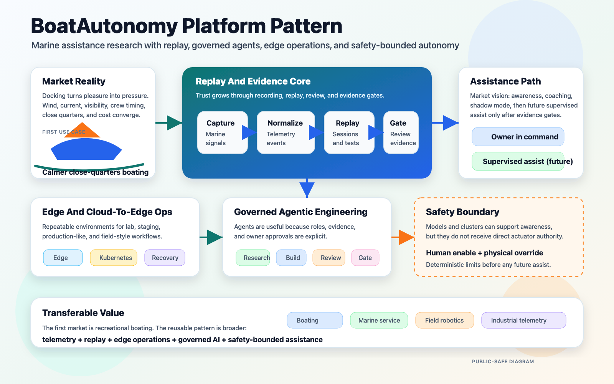

# BoatAutonomy

Toward calmer docking and smarter marine assistance, one evidence-gated
subsystem at a time.

BoatAutonomy is a public-safe view into a private, owner-built autonomy lab
around a recreational boat. It starts with a simple, market-readable problem:
docking is one of the most stressful and least forgiving moments in boating.
Wind, current, visibility, crew coordination, close quarters, and expensive
hardware all converge at low speed.

The working shorthand is "teaching my boat how to dock itself." The more
precise public claim is narrower: build the telemetry, replay, edge compute,
safety policy, and multi-agent review harness needed before a real vessel can
responsibly move from passive observation toward supervised docking-assist
experiments.

The long-term market intuition is broader than one boat: recreational boating
is a worldwide market where confidence, training, situational awareness,
maintenance insight, and safer close-quarters maneuvering all have value.
BoatAutonomy explores that opportunity without pretending the hard parts are
already solved.

This project is also evidence that disciplined AI-assisted development can be
applied to real physical systems without skipping governance, safety, or
operational rigor. For marine partners, technical collaborators, and future
startup conversations, it is meant to show how the builder thinks: instrument
first, replay before live use, separate authority from advice, and make
promotion depend on recorded evidence.

## Read This First

This is not the private implementation repo. It is a curated public surface.
It describes architecture, safety posture, evidence discipline, professional
context, and synthetic demo data without publishing live infrastructure
details, raw vessel data, credentials, repair procedures, or operational
runbooks.

## Public Purpose

This repository is the public-facing view of BoatAutonomy. For now, it is a
portfolio and credibility surface for relevant technical work. If the project
matures, this same public surface may eventually support conversations with
potential business partners, advisors, or funding sources.

That is not the current posture. This repo is not a product certification,
pitch deck, securities offering, live-system runbook, or claim that autonomous
docking is complete. It is a controlled way to show the technical thesis,
builder context, safety posture, and evidence discipline behind the private
project.

## Market Lens

BoatAutonomy is not only a resume artifact. It is an exploration of a possible
marine assistance product path:

- Make docking and close-quarters handling calmer for recreational boaters.
- Turn raw marine electronics into useful, replayable operating evidence.
- Build retrofit-friendly capabilities that respect existing vessels,
  owners, marinas, service yards, and safety expectations.
- Use AI and agents to accelerate engineering, analysis, and support while
  keeping physical authority bounded.
- Preserve a path beyond recreational docking if the same telemetry, replay,
  and safety-gated assistance patterns prove useful elsewhere.

## Current Public Scope

- Marine telemetry capture and replay using SeaTalk NG / NMEA 2000 concepts.
- SignalK-style normalized data paths and dashboard-driven inspection.
- Edge and cluster operations for repeatable lab, staging, and field workflows.
- Evidence records that separate observed facts, assumptions, risks, and
  approvals.
- A governed multi-agent development loop where implementation, review,
  research, and owner approval are deliberately separate.

This repository does not claim unattended autonomous docking. It does not
publish live vessel-control code, actuator wiring, raw capture files, endpoint
details, secrets, or enough operational detail to reproduce the private system.

## What This Demonstrates

- Cloud-to-edge architecture for constrained, real-world environments.
- Marine telemetry capture, normalization, replay, and dashboard inspection.
- Kubernetes used for orchestration, observability, and repeatability, not as
  a hard real-time safety controller.
- Multi-agent delivery with explicit roles for implementation, review,
  research, evidence, and owner approval.
- A safety boundary that treats model output as advice to a bounded system,
  not direct authority over physical control.
- Public communication that can speak to boaters, technologists, partners, and
  future business stakeholders without exposing sensitive operational detail.

## Technical Breadcrumbs

For government, commercial, and startup technologists, the deeper signal is
that BoatAutonomy is not a single demo script. It is an emerging platform
pattern with several mature-looking pieces already being exercised:

- Data and replay: raw marine signals become normalized, replayable sessions
  that can be inspected before new behavior is trusted.
- Edge operations: lab, staging, production, and field-style environments
  support repeatable deployment and evidence collection.
- AI-assisted engineering: multiple agents work in bounded roles for research,
  implementation, review, and evidence, with the owner retaining approval.
- Safety and governance: model output is treated as advice to a bounded
  system, not direct physical authority.
- Transferability: the same pattern may apply to other markets where physical
  systems need telemetry, replay, edge intelligence, and human-centered
  control boundaries.

Start with [technical-platform.md](docs/technical-platform.md) for the system
view and [ai-and-agentic-complexity.md](docs/ai-and-agentic-complexity.md) for
the AI/teamwork complexity behind the public surface.
Then follow the deeper visual trail:
[development-field-pipeline.md](docs/development-field-pipeline.md) for the
dev/test/field production line and
[agentic-collaboration-harness.md](docs/agentic-collaboration-harness.md) for
the governed multi-agent delivery loop.

## System Shape

Editable source: [boat-autonomy-platform.svg](assets/diagrams/boat-autonomy-platform.svg).

Kubernetes and agentic tooling are useful around the system: recording,
monitoring, replay, perception experiments, observability, and deployment
repeatability. They are not the hard real-time safety controller and do not
receive direct actuator authority.

## Why This Exists

The project started as curiosity and skill-building. It now defines a useful
intersection of the builder's career: embedded and real-time systems,
communications-traffic analysis, secure cloud architecture, isolated
environments, data resiliency, Kubernetes, edge operations, and AI-assisted
software delivery. It also reflects commercial and founder-side business
experience: consulting, business development, customer delivery, CFO / CIO
support, and long-running small-business operations.

The public repo is meant to make that work legible without turning a private
boat, home lab, or startup exploration into an open operational manual.

## Professional Context

This project is also a portfolio surface for relevant work opportunities. See
[RESUME.md](RESUME.md) for the public resume,
[docs/relevant-work.md](docs/relevant-work.md) for the kinds of work this
project is meant to make legible, and
[docs/portfolio-narrative.md](docs/portfolio-narrative.md) for the through-line
connecting the project to prior systems work.

## Repository Map

- [docs/architecture.md](docs/architecture.md) - staged system architecture
  and safety/control-plane split.
- [docs/safety-boundary.md](docs/safety-boundary.md) - what the project does
  and does not authorize.
- [docs/agentic-engineering.md](docs/agentic-engineering.md) - how the
  multi-agent build/review/research loop works.
- [docs/evidence.md](docs/evidence.md) - sanitized examples of evidence the
  private project records before promoting work.
- [docs/technical-platform.md](docs/technical-platform.md) - deeper technical
  platform view for technologists.
- [docs/ai-and-agentic-complexity.md](docs/ai-and-agentic-complexity.md) -
  AI, agent, replay, and governance complexity.
- [docs/development-field-pipeline.md](docs/development-field-pipeline.md) -
  dev/test/field production line and DevOps survey lane.
- [docs/agentic-collaboration-harness.md](docs/agentic-collaboration-harness.md) -
  Claude/Codex/Grok collaboration, review, reconciliation, and persistence.
- [docs/relevant-work.md](docs/relevant-work.md) - professional positioning
  and opportunity fit.
- [docs/portfolio-narrative.md](docs/portfolio-narrative.md) - why this
  project is a credible continuation of the builder's career arc.
- [docs/future-business-direction.md](docs/future-business-direction.md) -
  cautious future business direction, explicitly not a current solicitation.
- [docs/market-vision.md](docs/market-vision.md) - market-facing product
  intuition without product-readiness claims.
- [docs/roadmap.md](docs/roadmap.md) - capability progression from passive
  telemetry to supervised assistance.
- [docs/publication-guidelines.md](docs/publication-guidelines.md) - rules for
  deciding what can be made public.
- [demos/synthetic-nmea/](demos/synthetic-nmea/) - small synthetic telemetry
  example for public demos and screenshots.

## Public Review Status

Draft only. The private project owner must approve content before any GitHub
repository, profile, release, screenshot, or demo is made public.
