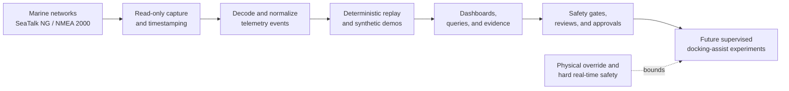

# BoatAutonomy

Teaching a real boat to dock itself, one governed subsystem at a time.

BoatAutonomy is a private, owner-built autonomy lab around a recreational
boat. The public-facing version of the project is intentionally narrower than
the working system: it describes the architecture, safety posture, evidence
discipline, and multi-agent engineering process without publishing live
infrastructure details, raw vessel data, credentials, or repair procedures.

The practical goal is staged docking assistance. The current public claim is
more conservative: build the telemetry, replay, edge compute, safety policy,
and review harness needed before any vessel can responsibly move from passive
observation toward supervised control experiments.

## Current Public Scope

- Marine telemetry capture and replay using SeaTalk NG / NMEA 2000 concepts.
- SignalK-style normalized data paths and dashboard-driven inspection.
- Edge and cluster operations for repeatable lab, staging, and field workflows.
- Evidence records that separate observed facts, assumptions, risks, and
  approvals.
- A governed multi-agent development loop where implementation, review,
  research, and owner approval are deliberately separate.

This repository does not claim unattended autonomous docking. It does not
publish live vessel-control code, actuator wiring, raw capture files, endpoint
details, secrets, or enough operational detail to reproduce the private system.

## System Shape

Kubernetes and agentic tooling are useful around the system: recording,
monitoring, replay, perception experiments, observability, and deployment
repeatability. They are not the hard real-time safety controller and do not
receive direct actuator authority.

## Why This Exists

The project started as curiosity and skill-building. It has become a compact
example of the builder's background in embedded systems, communications
traffic analysis, cloud operations, isolated environments, and AI-assisted
engineering. It also acts as a proving ground for using multiple agents as an
engineering team with explicit roles, review boundaries, and evidence gates.

The public repo is meant to make that work legible without turning a private
boat, home lab, or startup exploration into an open operational manual.

## Professional Context

This project is also a portfolio surface for relevant work opportunities. See
[RESUME.md](RESUME.md) for the owner-approved resume slot and
[docs/relevant-work.md](docs/relevant-work.md) for the kinds of work this
project is meant to make legible.

## Repository Map

- [docs/architecture.md](docs/architecture.md) - staged system architecture
  and safety/control-plane split.
- [docs/safety-boundary.md](docs/safety-boundary.md) - what the project does
  and does not authorize.
- [docs/agentic-engineering.md](docs/agentic-engineering.md) - how the
  multi-agent build/review/research loop works.
- [docs/evidence.md](docs/evidence.md) - sanitized examples of evidence the
  private project records before promoting work.
- [docs/relevant-work.md](docs/relevant-work.md) - professional positioning
  and opportunity fit.
- [docs/roadmap.md](docs/roadmap.md) - capability progression from passive
  telemetry to supervised assistance.
- [docs/publication-guidelines.md](docs/publication-guidelines.md) - rules for
  deciding what can be made public.
- [demos/synthetic-nmea/](demos/synthetic-nmea/) - small synthetic telemetry
  example for public demos and screenshots.

## Public Review Status

Draft only. The private project owner must approve content before any GitHub
repository, profile, release, screenshot, or demo is made public.
