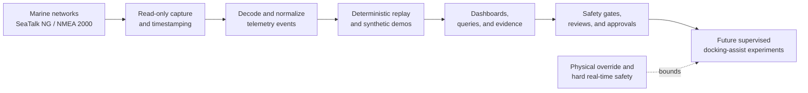

# BoatAutonomy

Teaching a real boat to dock itself, one governed subsystem at a time.

BoatAutonomy is a public-safe view into a private, owner-built autonomy lab
around a recreational boat. It is part engineering project, part portfolio,
and part evidence that disciplined AI-assisted development can be applied to
real physical systems without skipping governance, safety, or operational
rigor.

The working shorthand is "teaching my boat how to dock itself." The more
precise public claim is narrower: build the telemetry, replay, edge compute,
safety policy, and multi-agent review harness needed before a real vessel can
responsibly move from passive observation toward supervised docking-assist
experiments.

For teams working on secure cloud, edge telemetry, mission-critical systems,
or safety-bounded autonomy, this repo is meant to show how the builder thinks:
instrument first, replay before live use, separate authority from advice, and
make promotion depend on recorded evidence.

## Read This First

This is not the private implementation repo. It is a curated public surface.
It describes architecture, safety posture, evidence discipline, professional
context, and synthetic demo data without publishing live infrastructure
details, raw vessel data, credentials, repair procedures, or operational
runbooks.

## Current Public Scope

- Marine telemetry capture and replay using SeaTalk NG / NMEA 2000 concepts.
- SignalK-style normalized data paths and dashboard-driven inspection.
- Edge and cluster operations for repeatable lab, staging, and field workflows.
- Evidence records that separate observed facts, assumptions, risks, and
  approvals.
- A governed multi-agent development loop where implementation, review,
  research, and owner approval are deliberately separate.

This repository does not claim unattended autonomous docking. It does not
publish live vessel-control code, actuator wiring, raw capture files, endpoint
details, secrets, or enough operational detail to reproduce the private system.

## What This Demonstrates

- Cloud-to-edge architecture for constrained, mission-style environments.
- Marine telemetry capture, normalization, replay, and dashboard inspection.
- Kubernetes used for orchestration, observability, and repeatability, not as
  a hard real-time safety controller.
- Multi-agent delivery with explicit roles for implementation, review,
  research, evidence, and owner approval.
- A safety boundary that treats model output as advice to a bounded system,
  not direct authority over physical control.
- Public communication that is useful to the intended technical community
  without exposing sensitive operational detail.

## System Shape

Kubernetes and agentic tooling are useful around the system: recording,
monitoring, replay, perception experiments, observability, and deployment
repeatability. They are not the hard real-time safety controller and do not
receive direct actuator authority.

## Why This Exists

The project started as curiosity and skill-building. It now defines a useful
intersection of the builder's career: embedded and real-time systems,
communications-traffic analysis, secure cloud architecture, isolated
environments, data resiliency, Kubernetes, edge operations, and AI-assisted
software delivery. It also reflects commercial and founder-side business
experience: consulting, business development, customer delivery, CFO / CIO
support, and long-running small-business operations.

The public repo is meant to make that work legible without turning a private
boat, home lab, or startup exploration into an open operational manual.

## Professional Context

This project is also a portfolio surface for relevant work opportunities. See
[RESUME.md](RESUME.md) for the public resume,
[docs/relevant-work.md](docs/relevant-work.md) for the kinds of work this
project is meant to make legible, and
[docs/portfolio-narrative.md](docs/portfolio-narrative.md) for the through-line
connecting the project to prior systems work.

## Repository Map

- [docs/architecture.md](docs/architecture.md) - staged system architecture
  and safety/control-plane split.
- [docs/safety-boundary.md](docs/safety-boundary.md) - what the project does
  and does not authorize.
- [docs/agentic-engineering.md](docs/agentic-engineering.md) - how the
  multi-agent build/review/research loop works.
- [docs/evidence.md](docs/evidence.md) - sanitized examples of evidence the
  private project records before promoting work.
- [docs/relevant-work.md](docs/relevant-work.md) - professional positioning
  and opportunity fit.
- [docs/portfolio-narrative.md](docs/portfolio-narrative.md) - why this
  project is a credible continuation of the builder's career arc.
- [docs/roadmap.md](docs/roadmap.md) - capability progression from passive
  telemetry to supervised assistance.
- [docs/publication-guidelines.md](docs/publication-guidelines.md) - rules for
  deciding what can be made public.
- [demos/synthetic-nmea/](demos/synthetic-nmea/) - small synthetic telemetry
  example for public demos and screenshots.

## Public Review Status

Draft only. The private project owner must approve content before any GitHub
repository, profile, release, screenshot, or demo is made public.
