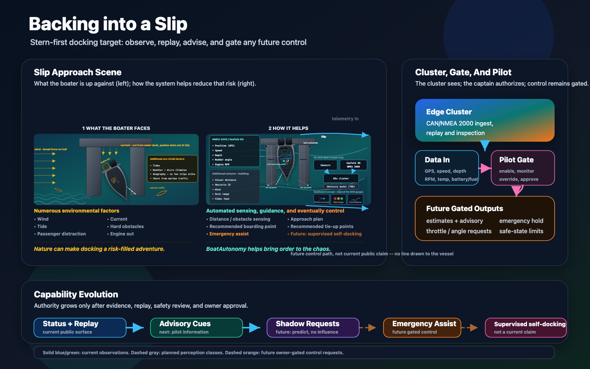
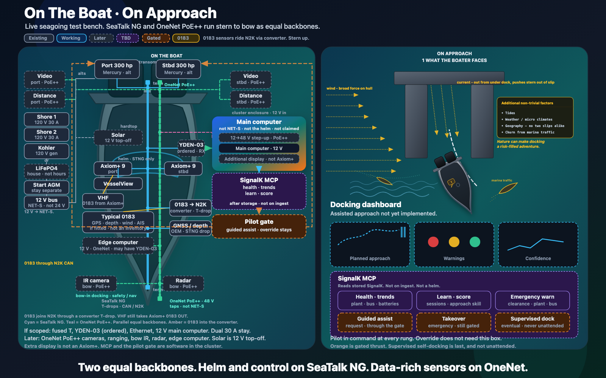
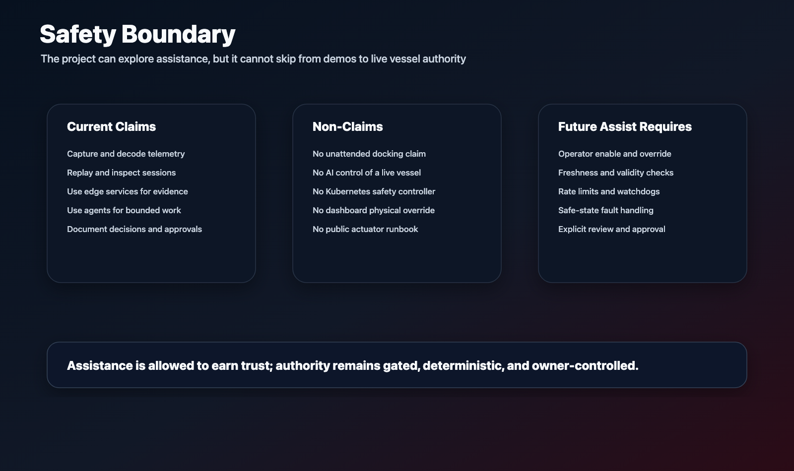
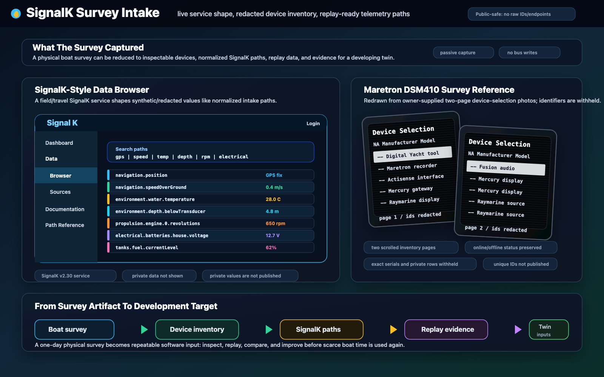
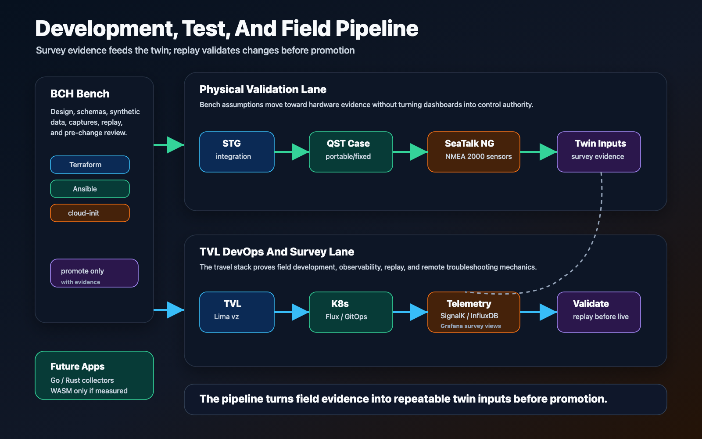

# BoatAutonomy

Teaching a boat to dock itself, with evidence before authority.

Docking is one of the most stressful moments in recreational boating: low
speed, close quarters, wind, current, crew coordination, spectators, and
expensive hardware all at once.

BoatAutonomy is a public-safe view into a private, owner-built autonomy lab
around that problem. The public claim is intentionally bounded: build the
telemetry, replay, edge compute, safety policy, and multi-agent review harness
needed before a real vessel can responsibly move from passive observation
toward supervised docking-assist experiments.

The method borrows from network digital-twin practice as a method, not a
product claim: instrument the observed system, build a behavioral baseline,
simulate or replay before live change, and compare expected behavior against
what actually happens. In BoatAutonomy, the current twin is the boat's
electronics/network substrate; the later vessel-motion twin is future work,
not a closed-loop control claim. The twin is an evolving representation, not a
frozen diagram: it changes as the target system changes, as understanding
improves, and as specific development or validation uses justify more
fidelity.

This repository is intentionally curated. It is a discussion surface, not a
contribution project: read, comment, and ask questions, but there is no implied
pull-request workflow until a later license and contribution policy exist. It
does not publish the private implementation, live topology, raw vessel data,
credentials, repair procedures, or operational runbooks.

## Why Read This

The problem is simple to understand, but technically hard to address
responsibly. A useful system has to observe before it estimates, replay before
it recommends, and earn trust before it gets anywhere near authority.

BoatAutonomy is worth reading because it treats that problem as a real
physical-system challenge, not a demo script. It asks how a small team, aided
by governed AI agents, can build a serious autonomy substrate while preserving
safety, evidence, review, and owner control.

Read [problem-and-opportunity.md](docs/problem-and-opportunity.md) for the
problem statement and opportunity framing.

## What This Is

BoatAutonomy is a public-facing project surface for a private applied-autonomy
lab. For now, it is a portfolio and credibility surface for relevant technical
work. If the project earns it, this same surface may eventually support
conversations with marine partners, advisors, technical collaborators, or
funding sources.

The lab is young, started in May 2026. Its evidence and governance plane is
ahead of any assistive behavior.

For that reason, this repo is not a product certification, pitch deck,
securities offering, live-system runbook, or claim that autonomous docking is
complete. It is a controlled way to show the technical thesis, builder
context, safety posture, and evidence discipline behind the private project.

Current public scope:

- Marine telemetry capture and replay using SeaTalk NG / NMEA 2000 concepts.
- SignalK-style normalized data paths and dashboard-driven inspection.
- Edge and cluster operations for repeatable lab, staging, and field workflows.
- Evidence records that separate observed facts, assumptions, risks, and
  approvals.
- A governed multi-agent development loop where implementation, review,
  research, and owner approval are deliberately separate.

This repository does not claim unattended autonomous docking. It does not
publish live vessel-control code, actuator wiring, raw capture files, endpoint
details, secrets, or enough operational detail to reproduce the private system.

The public/private boundary and evidence posture are linked visually below,
right after the platform shape.

## How It Works

Docking a boat into a slip it has never seen, in wind and current it cannot
control, is the target maneuver this project is built around. The scene
below shows that problem and the system's response to it - observation,
sensing, and guidance today, with any future control request still gated
behind the pilot.



Full discussion: [docking-problem-and-solution.md](docs/docking-problem-and-solution.md).
Editable source: [docking-system-evolution-v2.svg](assets/diagrams/docking-system-evolution-v2.svg).

The same Boston Whaler Conquest hull is the live seagoing test bench.
Factory SeaTalk NG stays the helm. One fused listen-only drop feeds a
cluster-hosted system of record (SoR). Later, OneNet PoE++ runs stern
to bow beside that bus for cameras and ranging — a second backbone,
not a recable of the plant.



Technical architecture: [marine-network-architecture.md](docs/marine-network-architecture.md).
Editable source: [follow-on-simple-hull-and-approach-v4.svg](assets/diagrams/follow-on-simple-hull-and-approach-v4.svg).

That hull and slip approach are one instance of a repeatable pattern, not
a one-off docking app:


Editable source: [boat-autonomy-platform.svg](assets/diagrams/boat-autonomy-platform.svg).

<table>
  <tr>
    <td width="33%">
      <a href="docs/scope-and-safety.md">
        
      </a>
      <br>
      <a href="docs/scope-and-safety.md"><strong>Safety boundary</strong></a>
      <br>
      What is safe, private, and not claimed.
    </td>
    <td width="33%">
      <a href="docs/evidence.md">
        
      </a>
      <br>
      <a href="docs/evidence.md"><strong>Evidence</strong></a>
      <br>
      Survey intake, replay evidence, and public-safe dashboard artifacts.
    </td>
    <td width="33%">
      <a href="docs/system-platform.md">
        
      </a>
      <br>
      <a href="docs/system-platform.md"><strong>System platform</strong></a>
      <br>
      Edge operations, replay, GitOps, telemetry, and field workflow.
    </td>
  </tr>
</table>

The problem, the boat, and the pattern are three layers of the same story:

- [docking-problem-and-solution.md](docs/docking-problem-and-solution.md) —
  the maneuver
- [marine-network-architecture.md](docs/marine-network-architecture.md) —
  plant, buses, and the cluster-hosted system of record
- [system-platform.md](docs/system-platform.md) — replay-first platform,
  pipeline, and technical breadcrumbs

Kubernetes and agents help record, replay, and rebuild. They are not the
helm and not the hard real-time safety controller.

The public story follows this order:

- Shape the system before naming tools.
- State the safety boundary before implying capability.
- Show evidence discipline before asking for trust.
- Add technical and agentic breadcrumbs only after the boundary is clear.

## Sample Telemetry

Public demos use synthetic telemetry shaped like normalized SignalK paths. The
values below are not from a real vessel, marina, route, customer, or field
session; they exist so screenshots, parsers, and dashboard examples can be
shown without publishing private telemetry.

```csv
timestamp,source,path,value,unit
2026-01-01T12:00:00Z,synthetic,navigation.position.latitude,34.0000,deg
2026-01-01T12:00:00Z,synthetic,navigation.position.longitude,-72.0000,deg
2026-01-01T12:00:00Z,synthetic,navigation.speedOverGround,0.42,m/s
2026-01-01T12:00:00Z,synthetic,environment.water.temperature,28.0,C
2026-01-01T12:00:00Z,synthetic,environment.depth.belowTransducer,4.8,m
2026-01-01T12:00:00Z,synthetic,propulsion.engine.0.revolutions,650,rpm
2026-01-01T12:00:00Z,synthetic,electrical.batteries.house.voltage,12.74,V
2026-01-01T12:00:00Z,synthetic,tanks.fuel.currentLevel,0.62,ratio
```

Full sample: [sample-telemetry.csv](demos/synthetic-nmea/sample-telemetry.csv).

## Why It Matters

BoatAutonomy has value because it combines an intuitive market problem with a
serious engineering method.

For boaters and marine operators, the possible value is calmer close-quarters
handling, better situational awareness, better training feedback, and more
useful evidence from existing marine electronics.

For technologists, the deeper signal is that this is not a single demo script.
It is an emerging platform pattern with several concrete pieces being
exercised:

- Data and replay: raw marine signals become normalized, replayable sessions
  that can be inspected before new behavior is trusted.
- Instrumented survey and digital twin: measured vessel and electronics
  behavior becomes a replay and simulation substrate for offline development.
- Network digital-twin method: pre-change validation against observed behavior
  reduces avoidable live-system debugging.
- Edge operations: lab, staging, field-prep, and field-style environments
  support repeatable deployment and evidence collection.
- AI-assisted engineering: multiple agents work in bounded roles for research,
  implementation, review, and evidence, with the owner retaining approval.
- Safety and governance: model output is treated as advice to a bounded
  system, not direct physical authority.
- Transferability: the same pattern may apply to other markets where physical
  systems need telemetry, replay, edge intelligence, and human-centered
  control boundaries.

The cost and schedule benefit is practical: more defects can be found in
replay, simulation, and review, and fewer debugging cycles have to wait for
scarce boat time, weather windows, marina conditions, or one-off field setups.

The AI story has two layers. One layer is how the project is built: Claude
Code, Codex, Grok, tmux, GitLab records, review findings, and owner decisions
are coordinated so speed does not erase accountability. The other layer is
future model-assisted behavior, which remains bounded by replay, shadow mode,
operator enablement, and safety review.

Read [agentic-engineering.md](docs/agentic-engineering.md) for the agentic
collaboration harness, GitLab-centered workflow, YAML policy example, and
review Markdown example.

## Where It Is Going

You are here: stages 0-2 are in motion and evidenced; stages 3 and higher
have not started.

The capability order still comes first:
[roadmap-and-business.md](docs/roadmap-and-business.md) describes progression
from governance and passive telemetry toward replay, estimation, shadow mode,
and supervised assist before any higher autonomy research.

The market lens is intentionally ambitious but bounded:

- Make docking and close-quarters handling calmer for recreational boaters.
- Turn raw marine electronics into useful, replayable operating evidence.
- Build retrofit-friendly capabilities that respect existing vessels,
  owners, marinas, service yards, and safety expectations.
- Use AI and agents to accelerate engineering, analysis, and support while
  keeping physical authority bounded.
- Preserve a path beyond recreational docking if the same telemetry, replay,
  and safety-gated assistance patterns prove useful elsewhere.

That same page also captures the product intuition and cautious future business
framing. It is explicitly not a current fundraising solicitation or
product-readiness claim.

## How Dan Can Help

The project started as curiosity and skill-building. It now defines a useful
intersection of the builder's career: embedded and real-time systems,
communications-traffic analysis, secure cloud architecture, isolated
environments, data resiliency, Kubernetes, edge operations, and AI-assisted
software delivery.

It also reflects commercial and founder-side business experience: consulting,
business development, customer delivery, CFO / CIO support, and long-running
small-business operations.

This project is a portfolio surface for relevant work opportunities and future
partner conversations. It makes visible a combination of systems engineering,
cloud-to-edge operations, AI-assisted delivery, governance, and business
judgment that can help adjacent physical-system and autonomy efforts.

See [builder-profile.md](docs/builder-profile.md) for the project/career
through-line and [RESUME.md](RESUME.md) for the public resume.

## Story Guide

The supporting files are grouped by the same questions the README answers.
Read straight down for the narrative, or jump to the part that matches the
conversation you want to have.

<table>
  <thead>
    <tr>
      <th width="22%" align="left">Story Beat</th>
      <th width="34%" align="left">Reader Question</th>
      <th align="left">Supporting Pages</th>
    </tr>
  </thead>
  <tbody>
    <tr>
      <td>Why read this</td>
      <td>What problem makes this worth attention?</td>
      <td><a href="docs/problem-and-opportunity.md">problem-and-opportunity.md</a></td>
    </tr>
    <tr>
      <td>What this is</td>
      <td>What is public, what is private, and what is not being claimed?</td>
      <td><a href="docs/scope-and-safety.md">safety boundary</a>, <a href="docs/evidence.md">evidence.md</a>, <a href="#sample-telemetry">sample telemetry</a></td>
    </tr>
    <tr>
      <td>How it works</td>
      <td>What is the system shape and technical approach?</td>
      <td><a href="docs/docking-problem-and-solution.md">docking-problem-and-solution.md</a> (problem), <a href="docs/marine-network-architecture.md">marine-network-architecture.md</a> (plant / SoR), <a href="docs/system-platform.md">system-platform.md</a> (pattern)</td>
    </tr>
    <tr>
      <td>Why it matters</td>
      <td>Why is the evidence/control plane ahead of assistive behavior?</td>
      <td><a href="docs/agentic-engineering.md">agentic-engineering.md</a>, <a href="docs/evidence.md">evidence.md</a></td>
    </tr>
    <tr>
      <td>Where it is going</td>
      <td>What is the capability path and future business hypothesis?</td>
      <td><a href="docs/roadmap-and-business.md">roadmap-and-business.md</a></td>
    </tr>
    <tr>
      <td>How Dan can help</td>
      <td>What skills, experience, and judgment does this make visible?</td>
      <td><a href="docs/builder-profile.md">builder-profile.md</a>, <a href="RESUME.md">RESUME.md</a></td>
    </tr>
  </tbody>
</table>

## Public Review Status

Public v1 surface. The repository is curated, read-only in posture, and still
bounded by the public/private line described above. Future updates should keep
evidence, safety boundaries, and owner approval visible before claims expand.
