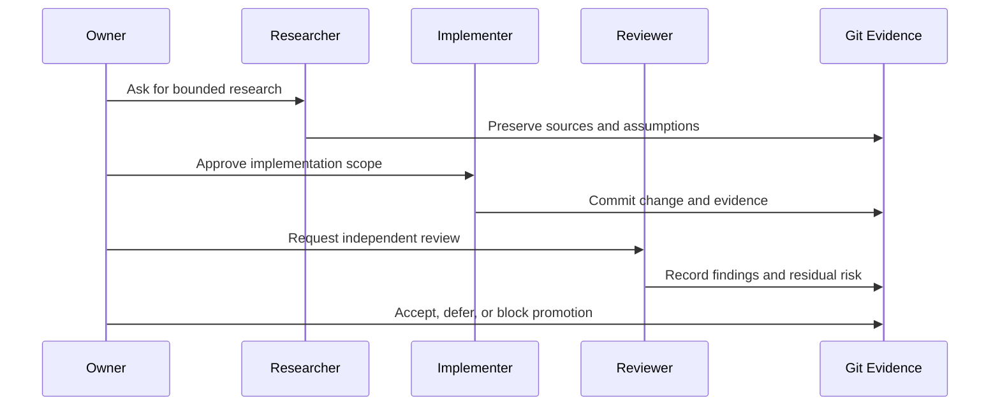

# Agentic Engineering

BoatAutonomy treats AI agents as an engineering team, not as an unchecked code
generator. The point is not that an agent can produce a patch. The point is
that roles, evidence, review boundaries, and approval gates can make agentic
work auditable.

## Roles

| Role | Responsibility |
| --- | --- |
| Owner | Sets scope, approves risk, performs hands-on physical work, and decides when private work may become public. |
| Implementer | Makes bounded changes in implementation repositories and records operational evidence. |
| Reviewer | Independently reads diffs, checks evidence, runs verification, and flags blockers. |
| Researcher | Gathers domain context, manuals, options, and tradeoffs for owner review. |
| Policy | Defines allowed work, prohibited shortcuts, data-handling rules, and approval boundaries. |

Different tools can occupy different roles. The private project has used
multiple AI systems in this style, with the owner retaining authority over
scope, physical systems, publication, and risk acceptance.

## Workflow

## Why It Matters

This project exercises the same discipline needed in higher-stakes software:
clear scope, reproducible evidence, separation of duties, failure analysis,
and explicit approval before promotion. The public repo should demonstrate the
method without exposing the private system.
