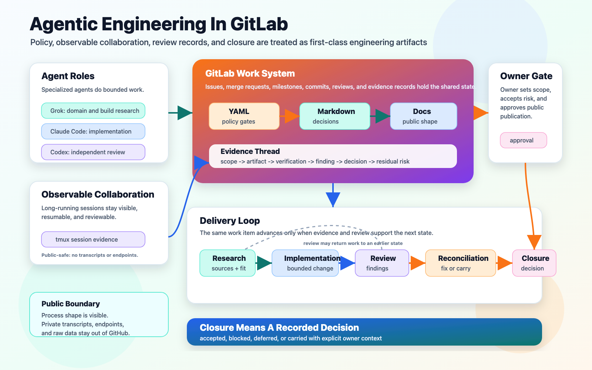
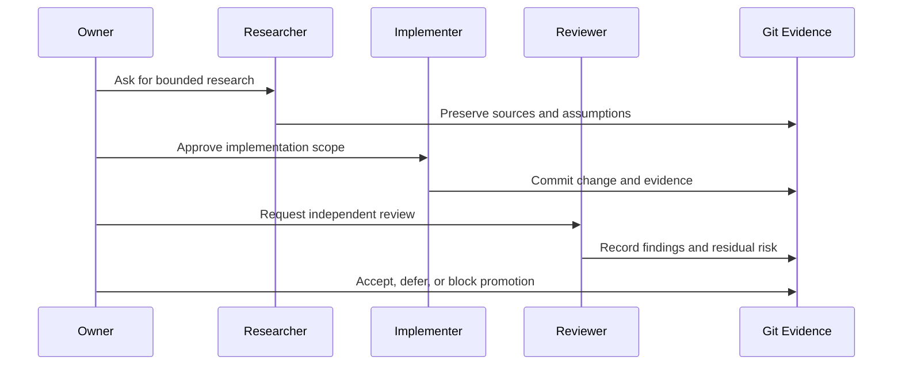

# Agentic Engineering

BoatAutonomy uses AI in two different ways, and the distinction matters.

First, AI agents help build, review, research, and document the project.
Second, future model-assisted behavior may help interpret vessel state or
suggest bounded assistance. Neither role gives AI unchecked authority over a
real boat.

## Agentic Collaboration Harness


Editable source:
[agentic-collaboration-harness.svg](../assets/diagrams/agentic-collaboration-harness.svg).

The project treats AI agents as a governed engineering team. In the private
workflow, Claude Code commonly implements, Codex commonly reviews, and Grok
commonly supports research. Those names are useful public context, but the
governance model is role-based: tools can change, authority boundaries cannot.

- Research agents gather domain material, manuals, options, and tradeoffs.
- Implementation agents make bounded changes in private implementation repos.
- Review agents independently inspect diffs, evidence, and operational claims.
- Documentation agents preserve decisions, assumptions, caveats, and handoffs.
- The owner sets scope, approves risk, and retains physical authority. Owner
  silence is not approval.

The complexity is not simply "an AI wrote code." The complexity is making
multi-agent work auditable:

- What was requested?
- What evidence supports the result?
- What assumptions were made?
- What was reviewed independently?
- What remains blocked, deferred, or private?
- What requires owner approval before promotion?

## Autonomy And Model Boundary

Future autonomy-related work has a different boundary. Model output may help
estimate, classify, summarize, or propose, but it must remain subordinate to a
bounded system. Model output is a request to a bounded controller, never a helm
command.

Tower is the private local lane for local LLM and model-training experiments.
That does not change the control boundary: model work remains research,
analysis, or bounded assistance until separately reviewed and approved.

Publicly, that means:

- Model output is not a command.
- Operators remain in authority.
- Assistance must have freshness, confidence, rate, and limit checks.
- Shadow mode comes before assist.
- Physical override and safe-state behavior are core requirements, not polish.

## GitLab-Centered Workflow



Editable source:
[agentic-engineering-gitlab-flow.svg](../assets/diagrams/agentic-engineering-gitlab-flow.svg).

The core pattern is that GitLab holds the work record while agents operate in
bounded roles. YAML policy is canonical for permissions and gates. Markdown
captures rationale, decisions, and review records. If YAML and Markdown drift,
that drift is a defect to reconcile, not a reason to guess intent. Docs
preserve the approved public shape, and tmux sessions make long-running
collaboration observable. Work advances from research to implementation,
review, reconciliation, and closure only when evidence supports the next state.

## Roles

| Role | Responsibility |
| --- | --- |
| Owner | Sets scope, approves risk, performs hands-on physical work, and decides when private work may become public. |
| Implementer | Makes bounded changes in implementation repositories and records operational evidence. |
| Reviewer | Independently reads diffs, checks evidence, runs verification, and flags blockers. |
| Researcher | Gathers domain context, manuals, options, and tradeoffs for owner review. |
| Policy | Defines allowed work, prohibited shortcuts, data-handling rules, and approval boundaries. |

Different tools can occupy different roles, but reviewers do not approve their
own work, and owner silence is not approval. The owner retains authority over
scope, physical systems, publication, and risk acceptance.

## Workflow



## Sample Governance YAML

The private project uses YAML and Markdown policy to keep agent work bounded.
This public-safe fragment shows the pattern, not the private schema:

```yaml
governance:
  version: public-example
  owner_authority:
    physical_systems: owner_only
    publication: owner_approval_required
    risk_acceptance: owner_only

  roles:
    researcher:
      may:
        - summarize_sources
        - identify_options
        - record_assumptions
      must_not:
        - approve_repairs
        - touch_live_systems

    implementer:
      may:
        - change_scoped_files
        - run_local_checks
        - preserve_evidence
      requires_review_for:
        - infrastructure_changes
        - data_boundary_changes
        - actuator_related_paths
        - public_artifacts

    reviewer:
      may:
        - inspect_diffs
        - verify_evidence
        - classify_findings
      must_not:
        - approve_own_work
        - accept_risk_for_owner

  promotion_gate:
    requires:
      - documented_scope
      - commit_or_artifact_reference
      - verification_commands
      - independent_review
      - owner_decision
    block_if:
      - live_actuator_authority_without_owner
      - secret_or_endpoint_in_public_artifact
      - unverified_claim_about_field_behavior
```

The important point is separation of authority. Agents can recommend, build,
review, and summarize. They do not approve risk for each other, and they do not
turn model output into physical authority.

One known harness failure mode is evidence latency: an implementer may finish
code before the review packet, runtime proof, or decision record catches up.
The countermeasure is to treat missing evidence as a blocker, not as implicit
approval.

## Sample Review Markdown

Markdown records make the review loop legible across time, machines, and
agents. A typical public-safe shape looks like this:

```markdown
# Review Note: <change title>

Status: request-changes
Scope: <what was reviewed>
Reviewed Ref: <commit or artifact id>

Evidence Checked:
- `git diff <base>...<ref>`
- `make check`
- replay or dashboard evidence: <sanitized pointer>

Findings:
- Blocker: <behavioral risk, missing evidence, or approval gap>
- Non-blocking: <cleanup or follow-up>

Decision:
- Fix before promotion.
- Carry only with explicit owner approval.

Public Boundary:
- No credentials, live endpoints, raw telemetry, or operational runbooks.

Residual Risk:
- <what remains true even after the fix>
```

This is deliberately plain. The value is not ceremony; it is that the next
agent, reviewer, or owner can see what was claimed, what was checked, what was
left unresolved, and who accepted the risk.

## Why This Is Hard

Marine environments combine problems that are familiar to government,
commercial, and industrial technologists:

- Noisy sensors and inconsistent source behavior.
- Intermittent connectivity.
- Edge compute limits.
- Real-world timing and recovery constraints.
- Auditability and evidence preservation.
- Human-machine teaming.
- Liability and trust boundaries.
- A gap between demo behavior and operational readiness.

That is why the project values replay, evidence, staged promotion, and
separation of authority. The public repo should make those concerns visible
without exposing the private implementation.

## Transferable Pattern

The interesting AI pattern may be bigger than docking:

- Use agents to accelerate engineering while preserving accountability.
- Use replay to test intelligence before live use.
- Use edge infrastructure for observability and continuity.
- Use policy and evidence to make promotion decisions reviewable.
- Keep model outputs inside deterministic and human-approved boundaries.

That pattern has possible value in marine systems, field robotics, remote
infrastructure, industrial telemetry, training tools, and other domains where
AI needs to work around real equipment instead of only inside software.
