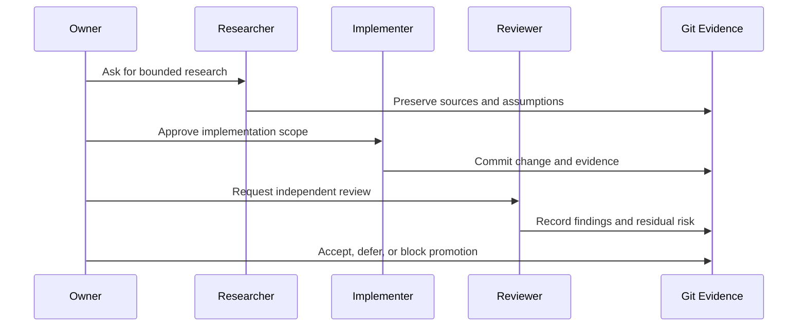

# Agentic Engineering

BoatAutonomy treats AI agents as an engineering team, not as an unchecked code
generator. The point is not that an agent can produce a patch. The point is
that roles, evidence, review boundaries, and approval gates can make agentic
work auditable.

For the public narrative and workflow image, start with
[ai-and-agentic-collaboration.md](ai-and-agentic-collaboration.md). This page
is the implementation-detail companion: roles, workflow, governance YAML, and
review Markdown examples.

## Roles

| Role | Responsibility |
| --- | --- |
| Owner | Sets scope, approves risk, performs hands-on physical work, and decides when private work may become public. |
| Implementer | Makes bounded changes in implementation repositories and records operational evidence. |
| Reviewer | Independently reads diffs, checks evidence, runs verification, and flags blockers. |
| Researcher | Gathers domain context, manuals, options, and tradeoffs for owner review. |
| Policy | Defines allowed work, prohibited shortcuts, data-handling rules, and approval boundaries. |

Different tools can occupy different roles. The private project has used
multiple AI systems in this style, with the owner retaining authority over
scope, physical systems, publication, and risk acceptance.

## Workflow



## Sample Governance YAML

The private project uses YAML and Markdown policy to keep agent work bounded.
This public-safe fragment shows the pattern, not the private schema:

```yaml
governance:
  version: public-example
  owner_authority:
    physical_systems: owner_only
    publication: owner_approval_required
    risk_acceptance: owner_only

  roles:
    researcher:
      may:
        - summarize_sources
        - identify_options
        - record_assumptions
      must_not:
        - approve_repairs
        - touch_live_systems

    implementer:
      may:
        - change_scoped_files
        - run_local_checks
        - preserve_evidence
      requires_review_for:
        - infrastructure_changes
        - data_boundary_changes
        - actuator_related_paths
        - public_artifacts

    reviewer:
      may:
        - inspect_diffs
        - verify_evidence
        - classify_findings
      must_not:
        - approve_own_work
        - accept_risk_for_owner

  promotion_gate:
    requires:
      - documented_scope
      - commit_or_artifact_reference
      - verification_commands
      - independent_review
      - owner_decision
    block_if:
      - live_actuator_authority_without_owner
      - secret_or_endpoint_in_public_artifact
      - unverified_claim_about_field_behavior
```

The important point is separation of authority. Agents can recommend, build,
review, and summarize. They do not approve risk for each other, and they do not
turn model output into physical authority.

## Sample Review Markdown

Markdown records make the review loop legible across time, machines, and
agents. A typical public-safe shape looks like this:

```markdown
# Review Note: <change title>

Status: request-changes
Scope: <what was reviewed>
Reviewed Ref: <commit or artifact id>

Evidence Checked:
- `git diff <base>...<ref>`
- `make check`
- replay or dashboard evidence: <sanitized pointer>

Findings:
- Blocker: <behavioral risk, missing evidence, or approval gap>
- Non-blocking: <cleanup or follow-up>

Decision:
- Fix before promotion.
- Carry only with explicit owner approval.

Public Boundary:
- No credentials, live endpoints, raw telemetry, or operational runbooks.

Residual Risk:
- <what remains true even after the fix>
```

This is deliberately plain. The value is not ceremony; it is that the next
agent, reviewer, or owner can see what was claimed, what was checked, what was
left unresolved, and who accepted the risk.

## Why It Matters

This project exercises the same discipline needed in higher-stakes software:
clear scope, reproducible evidence, separation of duties, failure analysis,
and explicit approval before promotion. The public repo should demonstrate the
method without exposing the private system.
