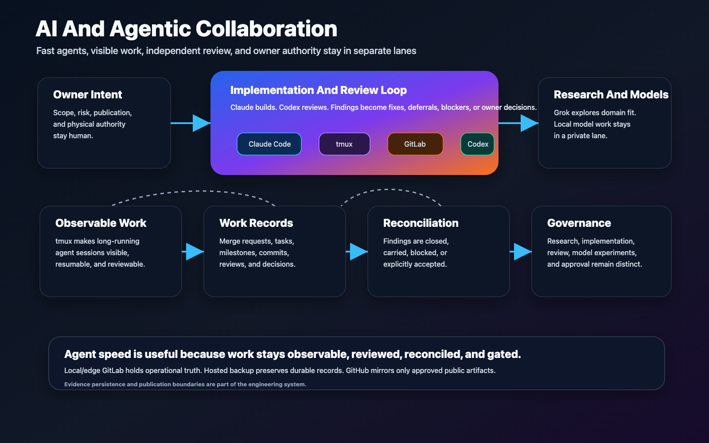

# AI And Agentic Collaboration

BoatAutonomy uses AI in two different ways, and the distinction matters.

First, AI agents help build, review, research, and document the project.
Second, future model-assisted behavior may help interpret vessel state or
suggest bounded assistance. Neither role gives AI unchecked authority over a
real boat.

## Agentic Workflow

Editable source:
[agentic-collaboration-harness.svg](../assets/diagrams/agentic-collaboration-harness.svg).

This page is the conceptual overview. The detailed role table, governance YAML,
and review Markdown examples live in
[agentic-engineering.md](agentic-engineering.md). That split keeps the public
story readable without repeating the same policy in multiple places.

## Agentic Engineering Layer

The project treats AI agents as a governed engineering team:

- Research agents gather domain material, manuals, options, and tradeoffs.
- Implementation agents make bounded changes in private implementation repos.
- Review agents independently inspect diffs, evidence, and operational claims.
- Documentation agents preserve decisions, assumptions, caveats, and handoffs.
- The owner sets scope, approves risk, and retains physical authority.

The complexity is not simply "an AI wrote code." The complexity is making
multi-agent work auditable:

- What was requested?
- What evidence supports the result?
- What assumptions were made?
- What was reviewed independently?
- What remains blocked, deferred, or private?
- What requires owner approval before promotion?

## Autonomy And Model Layer

Future autonomy-related work has a different boundary. Model output may help
estimate, classify, summarize, or propose, but it must remain subordinate to a
bounded system.

Tower is the private local lane for local LLM and model-training experiments.
That does not change the control boundary: model work remains research,
analysis, or bounded assistance until separately reviewed and approved.

Publicly, that means:

- Model output is not a command.
- Operators remain in authority.
- Assistance must have freshness, confidence, rate, and limit checks.
- Shadow mode comes before assist.
- Physical override and safe-state behavior are core requirements, not polish.

## Why This Is Hard

Marine environments combine problems that are familiar to government,
commercial, and industrial technologists:

- Noisy sensors and inconsistent source behavior.
- Intermittent connectivity.
- Edge compute limits.
- Real-world timing and recovery constraints.
- Auditability and evidence preservation.
- Human-machine teaming.
- Liability and trust boundaries.
- A gap between demo behavior and operational readiness.

That is why the project values replay, evidence, staged promotion, and
separation of authority. The public repo should make those concerns visible
without exposing the private implementation.

## Transferable Pattern

The interesting AI pattern may be bigger than docking:

- Use agents to accelerate engineering while preserving accountability.
- Use replay to test intelligence before live use.
- Use edge infrastructure for observability and continuity.
- Use policy and evidence to make promotion decisions reviewable.
- Keep model outputs inside deterministic and human-approved boundaries.

That pattern has possible value in marine systems, field robotics, remote
infrastructure, industrial telemetry, training tools, and other domains where
AI needs to work around real equipment instead of only inside software.
