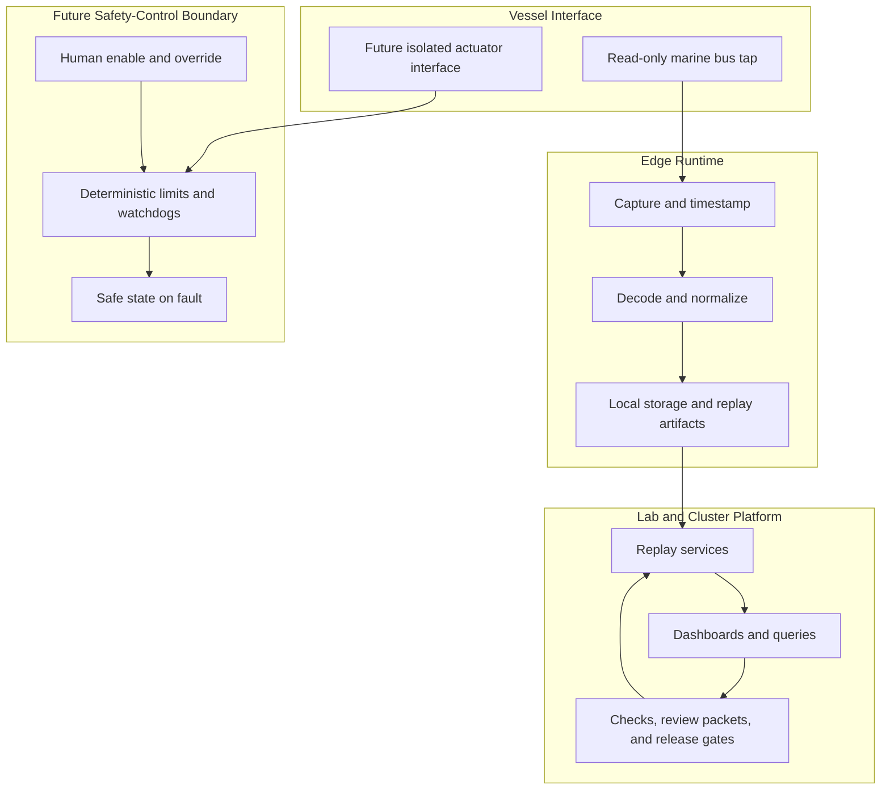

# Architecture

BoatAutonomy uses a staged architecture. Each layer earns promotion with
recorded evidence before the next layer is allowed to depend on it.

## Planes

## Design Rules

- Observe before estimating.
- Replay before shadow mode.
- Shadow mode before assist.
- Assist only with operator enable, physical override, bounded outputs, and
  fault handling.
- Keep raw vessel data, packet captures, and large artifacts outside public Git.
- Treat model output as a request to a bounded controller, not as a command.
- Keep Kubernetes, dashboards, and agents outside the hard real-time safety
  path.

## What The Public Repo Shows

The public repo can show normalized examples, synthetic telemetry, architecture
summaries, evidence formats, review discipline, and safety constraints.

It should not show live topology, internal network names, endpoint addresses,
real vessel tracks, raw captures, private dashboards, credentials, or detailed
procedures for operating the private system.
