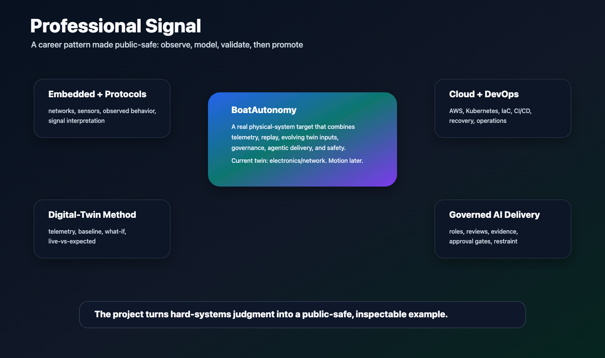

# Builder Profile

BoatAutonomy is not a claim that the boat already docks itself. It is a
public-safe way to show the kind of system I am building, the market problem I
care about, and the judgment I bring to it.

Editable source:
[professional-signal.svg](../assets/diagrams/professional-signal.svg).

## The Through-Line

The project ties together five long-running threads:

1. Embedded and communications systems. Earlier work included Unix / VxWorks,
   network stacks, protocol-heavy monitoring, telecom systems, and early
   neural-network protocol recognition.
2. Mission cloud and operations. Later work moved into isolated AWS
   environments, multi-account operations, data resiliency, automation,
   auditing, and mission-system transition into operations.
3. Edge and Kubernetes. Current work uses Kubernetes where it fits: repeatable
   lab, staging, field-prep, and edge services for capture, replay,
   observability, and deployment discipline.
4. Commercial and founder-side judgment. Commercial consulting and CFO / CIO
   support for a long-running 35-person business add the business-development,
   customer, systems, finance, and cash-flow context that matters for startup
   opportunities.
5. Governed AI-assisted engineering. BoatAutonomy uses multiple agents in
   bounded roles, with explicit policy, review, evidence, and owner approval
   before promotion.

## Why A Boat

A recreational boat is a compact but serious systems target. It has noisy
sensors, real networks, physical safety constraints, intermittent connectivity,
power and environmental limits, human override requirements, and enough
complexity that hand-waving shows quickly.

That makes it useful as a personal proving ground. It is small enough for one
owner-builder to move fast, but concrete enough that the work has to confront
real operational constraints.

It also has a human-centered market story. Recreational boating is
aspirational and global, but docking remains stressful for many owners. A
credible path toward calmer close-quarters handling could create value for
boaters, marinas, service providers, trainers, and adjacent small-vessel
markets. That possibility is worth exploring carefully.

## Roles And Conversations

- Principal, fractional, or advisory architecture for cloud-to-edge systems.
- Secure AWS / Kubernetes platform work in isolated, disconnected, or
  high-assurance environments.
- Edge telemetry, observability, replay, incident evidence, and data
  resiliency.
- AI-assisted software delivery where agent roles, audit trails, and promotion
  gates matter.
- Safety-bounded autonomy, robotics-adjacent infrastructure, and
  shadow-before-assist validation.
- Startup, founder-adjacent, or early-product work where technical execution,
  business judgment, and customer delivery have to move together.
- Marine product conversations where customer trust, safety, retrofit
  practicality, and serviceability matter as much as the technical demo.
- Technical due diligence for teams trying to separate impressive demos from
  systems that can actually be operated.

## What BoatAutonomy Makes Visible

- A real physical-system target, not a toy-only benchmark.
- A market-readable problem: docking and close-quarters handling are stressful
  even before any autonomy claims are made.
- A private control plane of policy, checklists, reviews, evidence, and
  owner-approved gates.
- Kubernetes used where it belongs: orchestration, replay, observability,
  deployment repeatability, and supervisory services.
- A hard boundary that keeps model output, dashboards, and cluster services
  away from direct real-time actuator authority.
- Multiple AI agents used as a governed engineering team, with implementation,
  review, and research roles kept separate.
- The discipline to say "not yet" when a demo is ahead of the safety case.
- The restraint to frame market possibility without pretending customer,
  regulatory, liability, or product-readiness questions are already resolved.
- A technical substrate that can be discussed with serious engineers without
  exposing private topology or live vessel details.

## Career Threads Reflected Here

- Embedded systems and communications-protocol work, including Unix / VxWorks
  systems and neural-network protocol recognition prototypes.
- Cloud and DevOps architecture for mission-critical systems in isolated and
  security-constrained environments.
- Data resiliency, migration, and operational recovery for large sensitive data
  holdings.
- Kubernetes, AWS, infrastructure as code, CI/CD, and account-governance work
  from prototype through operations.
- AI and ML platform decomposition where managed-service patterns must be
  adapted to constrained environments.
- Technical leadership across engineering teams, delivery rescue, cloud
  modernization, and program-scale architecture.
- Commercial consulting, business development, and 20 years of CFO / CIO
  support for a 35-person closely held business run operationally by my wife.

## Professional Signal

The intended audience does not need sensitive nouns to understand the pattern:
secure environments, constrained deployment, mission data, telemetry, replay,
audit, edge operations, and a hard boundary between experimental intelligence
and operational authority.

BoatAutonomy is a way to show that pattern in public without turning private
work into an exposure risk. For resume context, see [RESUME.md](../RESUME.md).

## Boundary

This public repo is intentionally incomplete. It should support professional
and partner conversation without revealing sensitive client history, private
vessel details, operational endpoints, raw telemetry, or implementation
material that belongs in the private project.
