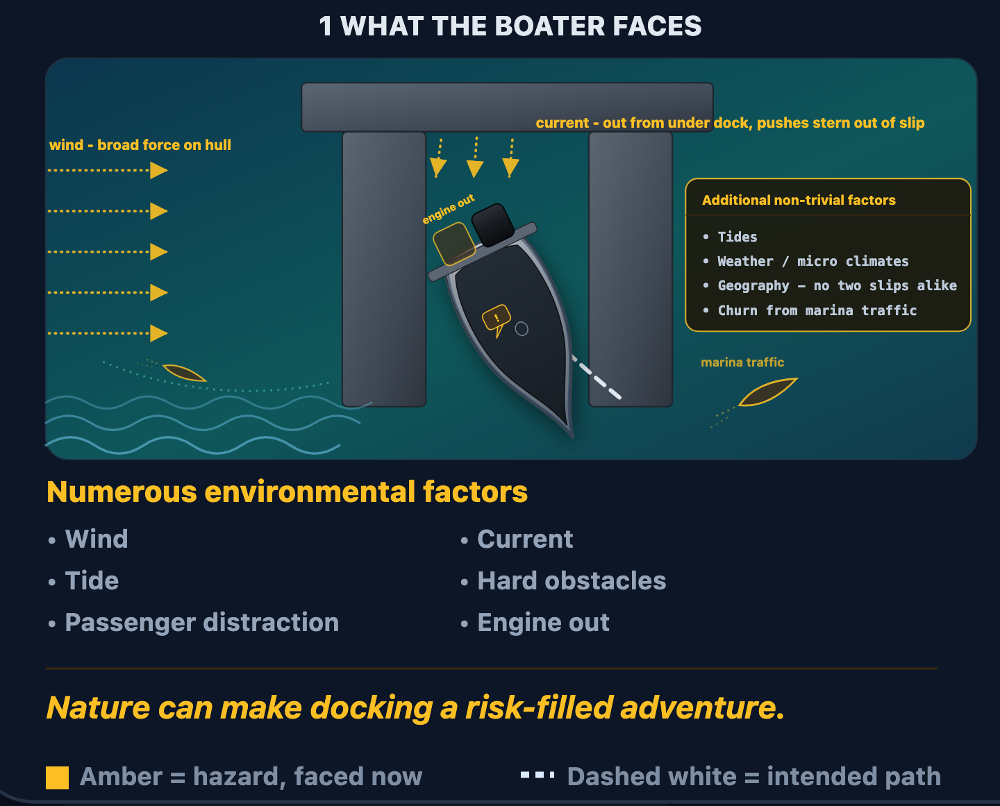
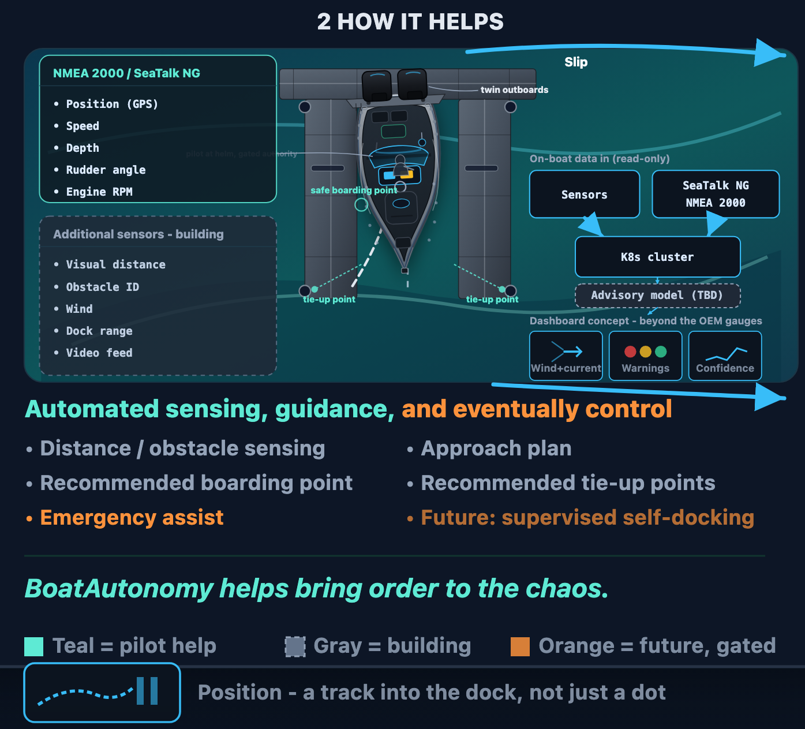

# Docking: Problem and Systems Response

Docking looks simple at the home slip, where the same wind pattern, the
same current, the same neighbors, and the same worn-in muscle memory show
up every time. Away from home, none of that holds. A visiting marina puts
a boater into a slip they've never seen, under conditions they don't
control, usually on the first and only attempt that day.

Editable source: [docking-system-evolution-v2.svg](../assets/diagrams/docking-system-evolution-v2.svg).

## The Complexity Of The Problem

- Wind as a broad force across the whole hull, not a single push from one
  point
- Current running out of the slip and onto the stern directly, fighting
  the boat in a different direction than the wind
- Both change with tide, weather and local micro climates, and the
  geography of the slip itself - no two marinas are alike, and no two
  slips are alike, especially the remote ones found on a day trip or
  extended travel
- Marina traffic and wake, churning the water right where precision
  matters, sometimes closing in on your own track
- A passenger offering advice at the exact moment the pilot has none to
  spare
- A degraded boat - shown here: one engine out, joystick control no longer
  reliable

Wind and current often shift mid-approach, not just before it, and rarely
act as a single clean vector: a beam wind can push broadly across the
whole hull while current runs hard out of the slip and onto the stern,
so the pilot is fighting two different directions of force at once, not
one. Tide, weather and local micro climates, and the slip's own geography
change what that combination feels like from one day to the next - and
"the slip's own geography" is doing a lot of work there: a home marina
gets learned over time, but a remote dock found on a day trip or an
extended cruise offers none of that familiarity. Wake and traffic from
other boats in the marina are constant, not occasional, and often arrive
at the exact moment a passenger is offering advice the pilot doesn't have
spare attention to weigh. Finger-dock spacing and cleat placement are
never guaranteed to match your boat - some marinas were built for a
fishing fleet, not a recreational hull. A dock's true condition often
isn't visible until you're already close.

Conditions are hard enough when everything on the boat is working. They
get much harder when it isn't. A single-engine return - one motor down,
joystick control no longer behaving predictably, trying to bring the boat
home on manual single-engine control - turns an already-difficult slip
approach into a genuinely demanding one, exactly when the pilot has the
least margin to spare.

The scene draws these pressures as concrete cues rather than background
texture: two other vessels converging on the slip, and a speech-bubble
at the helm standing in for a passenger's advice arriving at the wrong
moment.

**This is the problem the boater actually faces, and it's why this system
exists.** The goal is not a novelty feature - it's real risk reduction.
Nature alone can turn a routine docking into a risk-filled adventure,
before anything else on the boat has even gone wrong.

## Safety Through Risk Reduction

- Live boat data already on the NMEA 2000 / SeaTalk NG bus - position,
  speed, depth, rudder angle, engine RPM - brought into one place instead
  of scattered across separate gauges
- Additional sensing being built alongside it: visual distance, obstacle
  identification, wind, dock range, a video feed - not yet live
- Both of those feed into a small on-boat cluster that reads them in -
  nothing is written back to the boat's own systems
- An approach plan that accounts for the conditions on the left
- A recommended safe boarding point, marked before anyone has to guess
- Tie-up points - the lay lines - marked on both boat and dock

The boat's own instruments - GPS, speed, depth, rudder angle, engine RPM -
already exist on the NMEA 2000 bus today; the same data multiple analog
gauges show separately would be observed, recorded, and eventually
correlated in one place. Additional sensing - visual distance, obstacle
identification, wind, dock range, a video feed - is being built alongside
that, not yet live. Both sources feed into a small on-boat cluster whose
job is to read them in - the arrows only ever point inward; nothing
flows back out to the boat's own systems. Where those instruments live
on the boat, how a listen-only drop feeds a cluster-hosted system of
record, and how OneNet sits beside SeaTalk NG, is in
[marine-network-architecture.md](marine-network-architecture.md). This
page stays the maneuver view. That page is the plant and SoR view. As
advisory cues arrive on top of both:
distance sensing would account for what wind and current are doing right
now, not just where the dock is. A boarding point would be chosen for
calm water and dock condition, not guesswork. Tie-up points would be
marked on both boat and dock before a line is ever thrown.

None of that is a live product today - the diagram marks it as a
concept, not a screenshot. But the concept itself is the point: rather
than just redrawing the same position, speed, and depth a stock
instrument panel already shows, the value would come from combining
them into things no single OEM gauge computes alone - a fused wind-and-
current vector instead of two separate readouts, a plain warning status
instead of a wall of numbers, a confidence trend instead of an instant
reading, and eventually a track into the dock instead of a single GPS
dot.

Between the cluster and that dashboard, the diagram also marks a spot
for an **advisory model (TBD)** - deliberately unscoped for now. The
project already builds and reviews its own code through an agentic
harness; whether that same pattern extends into the boat-facing product
itself, and what shape that would take, is a real question worth asking,
not yet a decided one.

There is already a real precedent for the shape this could take: SignalK
has an MCP that reads NMEA 2000 data and produces a boat status and
trends report for owners who use it, on a schedule, without anyone
having to ask for it. The version of that idea for this project would be
an owner showing up at the boat and being met with a status and trends
briefing already waiting - boat condition, weather, whatever else is
relevant that day - instead of having to go find each reading
separately. A trend is what makes this more than a readout: not just
today's voltage, but "your battery bank may need replacing soon," noticed
before it becomes a problem on the water - or, just as often, something
milder and just as useful: "I'll keep a watch on it." Not every trend
needs to be an alarm; some are just worth noticing out loud. If it is
ever built, the same boundary applies as everywhere else on this page: a
proposal is a request to a bounded controller, never a helm command, and
it stays behind the same pilot gate as every
other stage.

That capability doesn't arrive all at once, and it doesn't arrive by
assertion. It grows in stages, and each stage has to earn the next one
with evidence, replay, safety review, and the owner's own approval:

1. **Status and replay** - today's public surface. The system observes and
   records; it recommends nothing and touches nothing.
2. **Advisory cues** - next. The system starts surfacing recommendations
   (a boarding point, a tie-up line, a sensed obstacle) for the pilot to
   use or ignore.
3. **Shadow requests** - further out. The system predicts what it would
   recommend for throttle or angle, but that prediction influences
   nothing; it exists only to be checked against what actually happened.
4. **Emergency assist** - gated, not current. Only once shadow predictions
   have proven reliable does a warning-and-assist capability become worth
   considering, and only under an explicit gate the pilot controls.
5. **Supervised self-docking** - not a current claim, and not the point of
   this document. If it's ever built, it would be built on everything
   proven in the stages before it and would remain supervised - the pilot
   approving, not the system acting alone - most valuable in precisely
   the degraded-boat scenarios described above, not just the easy days.

The pilot stays in command at every one of these stages. Nothing here
claims otherwise, now or as a future promise. BoatAutonomy's part in this
is to help bring order to that chaos, one gated stage at a time - not to
take the chaos away.

## Current Boundary

This page is not the private implementation, a live-system runbook, or a
claim that any docking assistance is running today. No raw vessel data,
no live topology or endpoints, and no third-party photos appear here or
in the source diagram. The diagram's own footer states plainly that no
control line is drawn from the future-capability panel to the vessel.

See [problem-and-opportunity.md](problem-and-opportunity.md) for why this
problem matters at a market level, and
[system-platform.md](system-platform.md) for the repeatable architecture
pattern this scenario is one instance of. The safety and privacy rules
that bound everything above are stated in full in
[scope-and-safety.md](scope-and-safety.md).
