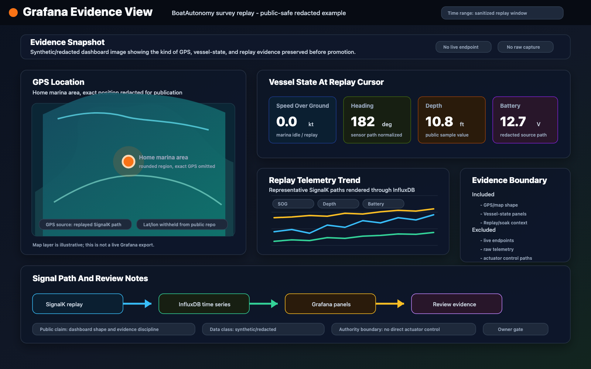

# Evidence

The private project records evidence before treating work as complete. Public
evidence is summarized and sanitized. It is meant to show engineering
discipline, not to publish live operational details.

## Evidence Types

- Checklists that separate planned gates from completed gates.
- Review records that lead with findings, blockers, and residual risk.
- Soak-test summaries with scope, duration, restarts, caveats, and excluded
  incident windows.
- Replay artifacts tied to schema versions, timestamps, and checksums.
- Screenshots or dashboards generated from synthetic or redacted data.
- Decision records that distinguish accepted design from advisory research.

## Public-Safe Facts

These facts are rounded and topology-free. They are included to make the
evidence posture concrete without publishing private endpoints, tracks,
locations, or operational procedures.

| Fact | Public-Safe Detail |
| --- | --- |
| Passive capture exists | The private project has captured real-vessel NMEA 2000 / NMEA 0183 class telemetry through a Wi-Fi gateway path, with no bus writes. |
| Replay and digital-twin inputs exist | Telemetry can flow through a SignalK -> InfluxDB -> Grafana style replay/inspection path, and instrumented survey observations are being shaped into simulation inputs. This is not a completed high-fidelity twin or a live-control claim. |
| Soak evidence exists | A 72-hour-class telemetry soak was documented with restarts, caveats, and excluded incident windows rather than treated as a perfect run. |
| Independent review works | At least one pre-promotion agent review caught a real runtime-interface mismatch before it reached live use. |

## Sanitized Examples

| Area | Public-Safe Summary |
| --- | --- |
| Telemetry capture | Marine-network captures were decoded into normalized telemetry paths and replayed into dashboards for inspection. |
| Instrumented survey | Survey-style observations turn vessel electronics and operating context into reusable evidence for replay, simulation, and review. |
| Soak testing | Edge telemetry stacks were soak-tested with documented restarts, resource behavior, incident windows, and unresolved caveats. |
| Cluster migration | Infrastructure changes were reviewed against live evidence before promotion, including discovery, network identity, and control-plane behavior. |
| Agent review | Independent review caught real defects before live changes, including assumptions that did not match runtime interfaces. |
| Data handling | Raw telemetry, packet captures, credentials, and large artifacts stay out of public Git; public demos use synthetic data. |

The schedule and cost signal is deliberately qualitative: replayable survey
evidence lets more defects be found before scarce boat time, weather windows,
and field setups are involved. Public summaries do not publish raw tracks,
private locations, detailed timings, or dollar claims.

## Dashboard Evidence Example

The image below is a public-safe Grafana-style evidence screenshot generated
from synthetic/redacted values. It shows the kind of GPS location, vessel-state
panels, replay trend, and SignalK -> InfluxDB -> Grafana evidence that the
private project preserves before treating telemetry work as complete.

The marker represents the home marina area, but exact coordinates, exact
position, raw telemetry, live dashboard endpoints, and actuator/control paths
are intentionally omitted.

## Public Demo Data

The sample under [demos/synthetic-nmea](../demos/synthetic-nmea/) is synthetic.
It is shaped like normalized marine telemetry but is not from a real vessel,
marina, route, customer, or field session.
