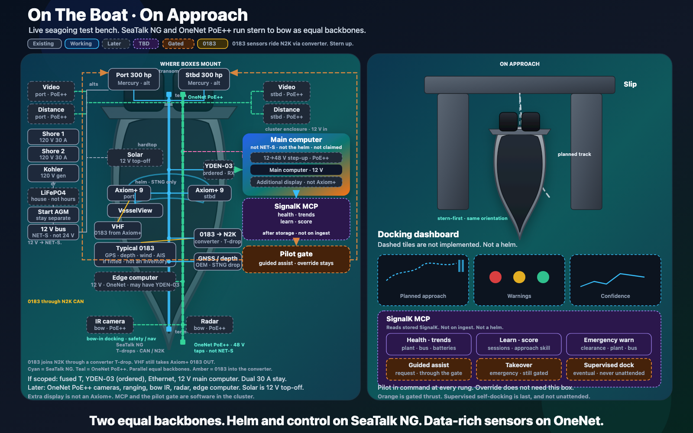
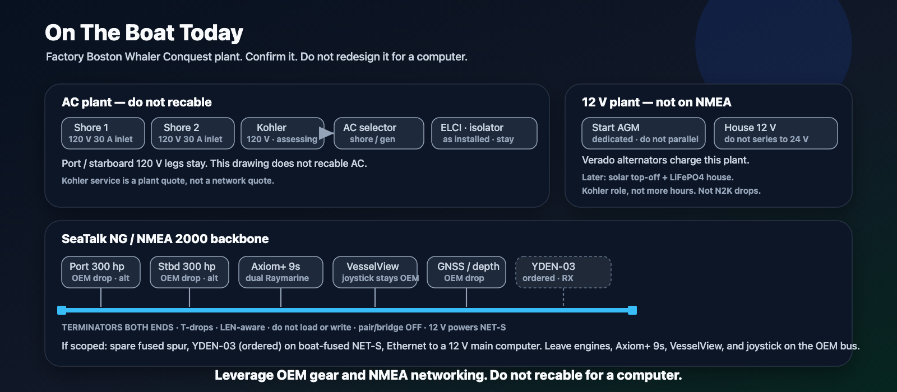
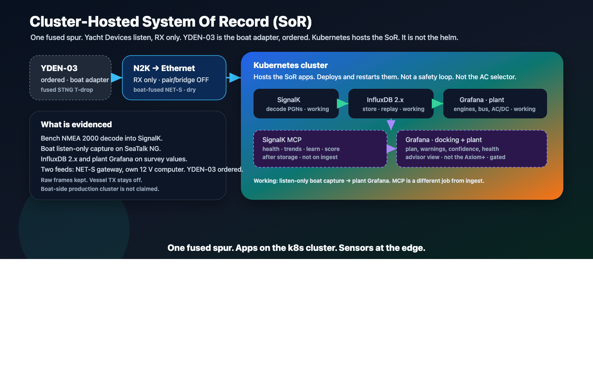
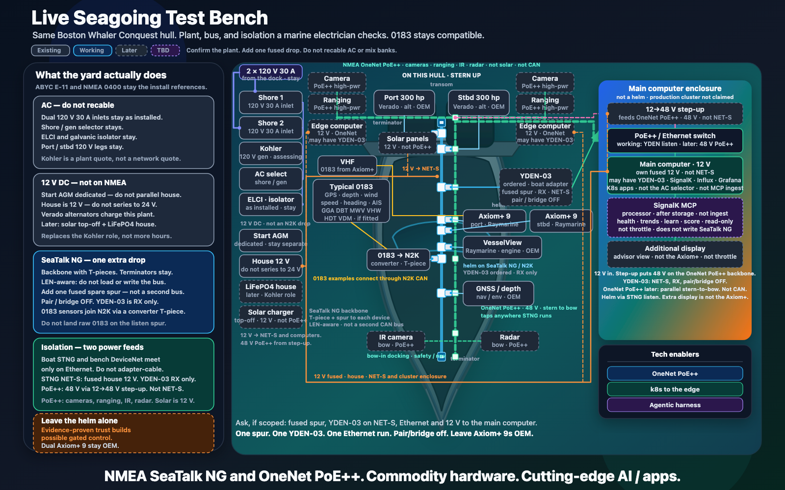
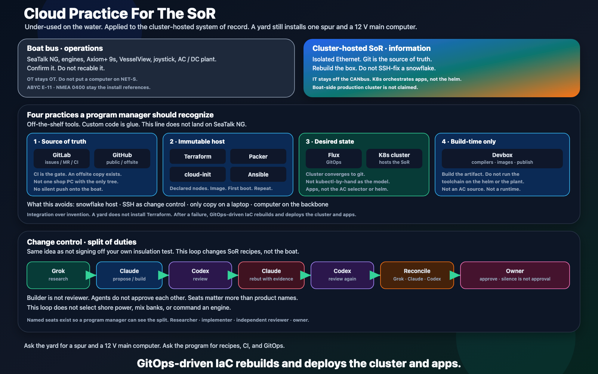
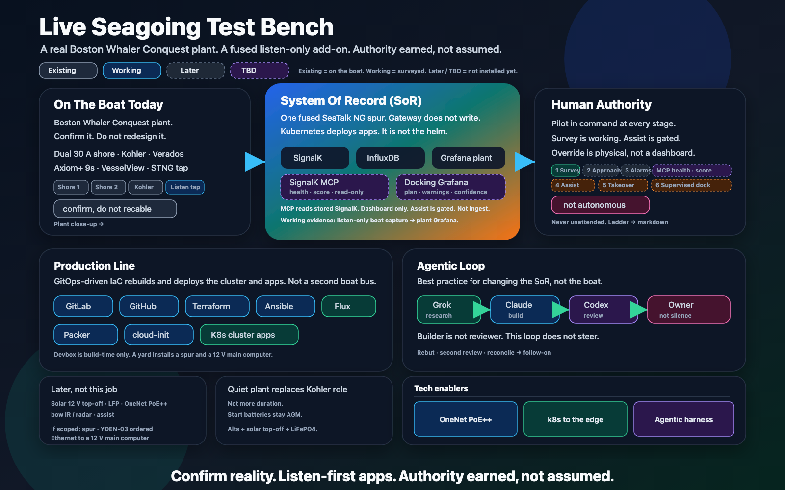

# Live Seagoing Test Bench

The companion page, [Docking: Problem and Systems Response](docking-problem-and-solution.md),
is the problem: a slip the boat has never seen, in wind and current it
does not control. This page is the boat that has to carry any answer.

A Boston Whaler Conquest already has a working electrical
plant and a SeaTalk NG / NMEA 2000 backbone. Dual Raymarine Axiom+ 9
chartplotters and VesselView are on that bus. The joystick is OEM.
That plant stays the plant.

BoatAutonomy adds one fused listen-only drop and a cluster-hosted
system of record (SoR) that stores what it hears. Later, a second
backbone — NMEA OneNet with PoE++ — can run stern to bow beside
SeaTalk NG as an equal citizen, not a side spur. Helm and control
stay on SeaTalk NG. Cameras, ranging, bow IR, and radar ride OneNet.
Kubernetes, models, and dashboards live on that cluster. They do not
recable shore power, mix battery banks, or command throttle, steering,
or joystick.

**Leverage OEM gear and NMEA networking. Do not recable for a computer.**

## On The Boat · On Approach

The simple picture of that split. Left is the hull, stern-first, where
boxes actually mount. Right is the docking view a skipper would look
at — dashboard only, not a helm, not a write path. Solid chips are on
the boat today or already evidenced. Dashed chips are architecture
that is not installed yet.



Editable source:
[follow-on-simple-hull-and-approach.svg](../assets/diagrams/follow-on-simple-hull-and-approach.svg).

**Two equal backbones. Helm and control on SeaTalk NG. Data-rich
sensors on OneNet.**

The cyan line down the center of the hull is SeaTalk NG / NMEA 2000:
T-pieces, terminators both ends, house 12 V on NET-S. Engines, the
Axiom+ 9s, VesselView, and GNSS / depth already hang off that bus.
The working add-on is one fused spare T and a Yacht Devices listen
gateway. Pair/bridge stays off. The gateway does not write. **YDEN-03**
is the named boat adapter, ordered and not yet on the boat. Survey
evidence so far is a Yacht Devices gateway on the installed SeaTalk NG
network.

The teal dashed line beside it is later NMEA OneNet: IEEE 802.3
Ethernet with IEEE 802.3bt PoE++ at 48 V, IEEE 1588 time, running
stern to bow as a second physical backbone. High-power sensors —
transom cameras and ranging, later bow IR and radar — tap that run.
Video does not land on CAN. The two cables may cross on the drawing;
they do not splice. Helm interface stays SeaTalk NG only. There is no
Ethernet overlay to the plotters.

A third color, amber, is legacy NMEA 0183. Typical talkers (GPS,
depth, wind, speed log, heading, AIS — if fitted, not a counted
inventory) join the same N2K backbone through an 0183-to-N2K converter
that is a normal T-drop. The listen gateway then sees that traffic on
CAN. Raw 0183 copper does not land on the listen spur. VHF can still
take Axiom+ 0183 OUT for DSC.

**Where it mounts**

- **Transom.** Twin 300 hp Mercury outboards and their alternators,
  already on SeaTalk NG. Later, video and distance on both sides, on
  OneNet PoE++.
- **Aft plant.** Dual 120 V 30 A shore inlets. Kohler as the 120 V
  generator, or later a LiFePO4 house bank that takes over that
  *role* — quieter, more electrical, not more hours. House is 12 V.
  Start AGM stay separate. 12 V powers NET-S. Do not series the house
  bank to 24 V or 48 V.
- **Hardtop.** Later solar panels and a small charger as 12 V house
  top-off. Solar is a source, not a PoE++ load. It does not land on
  OneNet.
- **Helm.** Dual Axiom+ 9 and VesselView on SeaTalk NG. Joystick
  stays. The extra display for the advisor view is not an Axiom+.
- **Cluster enclosure.** Main computer on fused house 12 V, not on
  NET-S, not on the helm. Later, a 12→48 V step-up in that same
  enclosure feeds 48 V onto the OneNet backbone. SignalK, storage,
  Grafana, and a later advisor sit in software on that computer.
- **Bow.** Later IR camera and radar on OneNet PoE++, for bow-in
  docking, safety, and navigation.
- **Later on OneNet.** An edge computer, also on 12 V, that may have
  its own YDEN-03 on another fused T-piece of the same SeaTalk NG
  backbone — extra drops, not a second CAN bus.

The orange dashed line toward the engines is a later **pilot gate**:
software may request; the override stays physical. Nothing on this
drawing is a throttle wire.

**On approach**

The right pane is what a skipper would actually watch: a planned
stern-first track into the slip, red / yellow / green clearance
warnings, and a confidence trace that the plan still matches sensors.
Dashed tiles are not implemented.

A SignalK MCP (Model Context Protocol) adapter, when it exists, sits
**after storage**, not on ingest. It lets an agent read stored SignalK
for health and trends, learning and scoring, and emergency warnings.
It does not write N2K. Guided assist, emergency takeover, and
supervised self-docking remain later gated requests through the pilot
gate, not MCP features. Self-docking, if it is ever built, is
supervised and never unattended.

The pilot is in command at every rung. Override does not need this
box.

## The Factory Plant

Confirm it. Do not redesign it for a computer.



Editable source: [follow-on-boat-plant.svg](../assets/diagrams/follow-on-boat-plant.svg).

**AC.** Two factory 120 V 30 A shore inlets. A Kohler gasoline
generator as a 120 V source, currently under assessment — service it
if that is sound; do not disable safety shutdowns as a repair. Shore /
generator select, ELCI, galvanic isolator, and the port and starboard
120 V legs stay as installed. This drawing does not recable AC.

**DC.** Twin 300 hp outboards and their alternators charge the house
plant. Start batteries remain factory AGM and separate. House is a
12 V platform, not 24 V. Later solar is top-off, not house power.
Later LiFePO4, if the generator role is retired, is quieter electrical
capacity — not more hours underway.

**Bus.** Raymarine SeaTalk NG, which is NMEA 2000 on the water. Dual
Axiom+ 9, VesselView, GNSS, depth, and environment sources already
drop from that backbone. House 12 V powers NET-S. Terminators stay
both ends. LEN-aware: do not load or write. The one extra drop is a
fused spare spur for a listen-only Yacht Devices gateway. **YDEN-03**
is the named boat adapter, ordered. That spur is a normal T-piece. It
is not a second backbone.

ABYC E-11 and NMEA 0400 remain the install references. This page does
not replace them.

Isolation rules that keep the computer from becoming a second boat:

- Do not join a lab DeviceNet drop onto the boat SeaTalk NG. The two
  buses meet only on Ethernet.
- Do not turn on N2K-over-Ethernet pair/bridge mode.
- YDEN-03 power is boat-fused NET-S. Compute uses its own fused 12 V.
- Later 48 V PoE++ is a 12→48 V step-up in the computer enclosure,
  feeding the OneNet backbone. Do not series house packs to 48 V.
  PoE++ is not NET-S.

## Listen-First Apps

This is what the project actually adds: one spur, a listen-only
gateway, and apps that decode, store, and show what the boat already
says.



Editable source:
[follow-on-cluster-sor.svg](../assets/diagrams/follow-on-cluster-sor.svg).

```text
SeaTalk NG / NMEA 2000
  -> listen-only gateway (pair/bridge OFF)
  -> SignalK              decode / normalize          [working]
  -> InfluxDB 2.x         persist / replay            [working]
  -> Grafana (plant)      engines, bus, AC/DC         [working]
         |
         |  Kubernetes deploys and restarts those apps
         v
  -> SignalK MCP          health, trends, learn, score [TBD]
                          emergency warnings (read-only)
  -> Grafana              plant health + docking view  [TBD]
```

What is already evidenced:

- Bench NMEA 2000 decode through an Actisense NGT-1 into SignalK.
- Boat listen-only capture through a Yacht Devices gateway on the
  installed SeaTalk NG network.
- SignalK into InfluxDB 2.x, and Grafana over real decoded survey
  values.
- The same software pattern rehearsed on portable hardware. A
  production cluster on the boat is **not** claimed.

Kubernetes sits **around** that pipeline. It deploys and restarts
SignalK, InfluxDB, and plant Grafana. It is not the helm, not the AC
selector, and not the hard real-time safety controller.

The SignalK MCP is a different job from ingest. It reads stored
SignalK. It does not sit on the cyan ingest path, does not write PGN
traffic, and does not command engines. Product, model, and host are
unset — that is what TBD means. Assist, takeover, and supervised
docking stay behind the pilot gate. Do not read this page as an AI
helm or a write path.

Raw frames stay with decoded values so a decoder change does not burn
another boat day.

## Authority Earned, Not Assumed

Capability is a ladder. Each rung needs evidence before the next one
is even a design task. Survey is the only autonomy stage with working
evidence today.

| Stage | Job | Status |
|---|---|---|
| 1 Survey | Listen, decode, store, present | **Working** |
| 2 Approach plan | Stored SignalK → docking Grafana | TBD / later |
| 3 Alarms / emergency warnings | Range, bus, plant, freshness | Later |
| 4 Guided assist | Bounded request while enable is held | Gated, not claimed |
| 5 Emergency takeover | Gated request in a warning state | Gated, not claimed |
| 6 Supervised self-docking | Pilot supervising; every abort recorded | Later, never unattended |

The pilot stays in command at every stage. Physical override does not
depend on Kubernetes, a model, or a network link. Unattended docking
is outside this architecture. Approach plan, alarms, assist, and
supervised docking are not a request for a control wire today.

## Device And Network Boxology

The drawing a marine electrician can put a finger on. Same stern-first
Boston Whaler Conquest outline. Left pane is install rules. Right pane
is named devices on that hull.



Editable source: [follow-on-boxology.svg](../assets/diagrams/follow-on-boxology.svg).

**NMEA SeaTalk NG and OneNet PoE++. Commodity hardware. Cutting-edge
AI / apps.**

**What the yard actually does.** Four checks, then a stay-out:

1. **AC — do not recable.** Dual 120 V 30 A inlets, shore/gen selector,
   ELCI, galvanic isolator, port and starboard 120 V legs. Kohler
   service is a plant quote, not a network quote.
2. **12 V DC — not on NMEA.** Start AGM dedicated (do not parallel
   house). House is 12 V (do not series to 24 V). Verado alternators
   charge this plant. Later solar is top-off; later LiFePO4 replaces
   the generator role, not more hours.
3. **SeaTalk NG — one extra drop.** Backbone with T-pieces. Terminators
   stay. LEN-aware: do not load or write. Add one fused spare spur, not
   a second bus. Pair/bridge OFF. YDEN-03 is RX only. Engines, dual
   Axiom+ 9, VesselView, and joystick stay OEM.
4. **Isolation — two power feeds.** Boat SeaTalk NG and any lab
   DeviceNet meet only on Ethernet; do not adapter-cable them. YDEN-03
   is boat-fused NET-S, dry mount, RX only. Each computer takes fused
   house 12 V, not NET-S. House 12 V also powers SeaTalk NG NET-S.
   PoE++ is 48 V from a 12→48 V step-up in the computer enclosure, not
   series packs. Later OneNet PoE++ carries cameras, ranging, bow IR,
   radar, and other high-power sensors. Edge computers may also have
   a YDEN-03 on another fused T of the same backbone.
5. **Leave the helm alone.** Orange on the drawing:
   evidence-proven trust builds **possible** gated control — later,
   not a live write path. Override stays physical. Dual Axiom+ 9 stay
   OEM. The additional display is not an Axiom+. Helm interface is
   SeaTalk NG / NMEA 2000 only.

**On this hull.** Plant is stacked off the backbone so it cannot be
misread as N2K drops. Two independent 120 V 30 A dock feeds land on
Shore 1 and Shore 2 (not a 240 V inlet), then the installed AC
selector, Kohler, and ELCI / isolator. The cyan line is SeaTalk NG,
terminated both ends. Each N2K device hangs off a T-piece adapter and
spur — engines, dual Axiom+ 9, VesselView, GNSS, the 0183-to-N2K
converter, and the fused YDEN-03. None of those boxes sit on the
backbone.

The main computer, and later edge computers, may each have a YDEN-03
as their SeaTalk NG adapter: fused spur, NET-S, RX only, pair/bridge
OFF. A fused 12 V house feed goes to each computer. That 12 V run is
not NET-S and is not a SeaTalk drop.

The parallel teal OneNet PoE++ Ethernet runs stern to bow beside
SeaTalk NG, with PoE++ taps along that run so a camera or ranging
sensor can land anywhere an STNG device might. Those loads use 48 V
PoE++ from the step-up in the computer enclosure. House 12 V powers
NET-S and that enclosure. OneNet does not replace engine or Axiom+
N2K drops. Video does not go on CAN. Computers never sit on the NMEA
backbone.

Raymarine, Mercury, and Yacht Devices stay the network. SignalK,
Grafana, and the advisor ride the cluster-hosted SoR. The cluster meets
the helm only through a listen-only Yacht Devices gateway. YDEN-03 is
that adapter class, ordered.

If a yard job is opened, it is ordinary marine-electronics work:

1. Confirm a spare SeaTalk NG spur, or add one, fused and terminated.
2. Mount a listen-only YDEN-03 in a dry, serviceable location when it
   is on hand. Boat-fused NET-S. Pair/bridge OFF. RX only. Until then
   a Yacht Devices survey gateway can stand in on the same fused spur.
3. Run Ethernet to a dedicated main computer on its own fused house
   12 V. Do not land that enclosure on the boat backbone. Do not put
   the computer on NET-S. Later 48 V PoE++ is a step-up in that same
   enclosure, not the first install.
4. Leave engines, dual Axiom+ 9, VesselView, and joystick on the OEM
   SeaTalk NG bus.

Plant work, if it is opened separately: confirm both 30 A inlets,
ELCI, and isolator; quote generator return-to-service versus retiring
that role; if retired, LiFePO4 house, small solar, and charge from the
existing alternators. Engine mechanical work is a separate plant
conversation. It is not this network and it is not a control install.

## How The System Of Record (SoR) Is Hosted

The boat bus stays ordinary operations technology. The cluster-hosted
system of record is produced with cloud and DevOps practice the marine
industry under-uses. A yard does not install this line. A yard
installs a fused spur and a 12 V main computer. After a failure,
GitOps-driven infrastructure as code (IaC) rebuilds and deploys the
cluster and apps.



Editable source:
[follow-on-production-and-loop.svg](../assets/diagrams/follow-on-production-and-loop.svg).

**OT stays OT.** SeaTalk NG, engines, dual Axiom+ 9, VesselView,
joystick, AC / DC plant. Confirm. Do not recable. Do not put a
computer on NET-S.

**IT stays off the CANbus.** Isolated Ethernet. Git is the source of
truth. Kubernetes orchestrates apps, not the helm. A production
cluster on the boat is not claimed.

**Four practices.** Integration over invention. Off-the-shelf tools.
Custom code is glue.

1. **Source of truth.** GitLab holds issues, merge requests, and CI —
   CI is the gate. GitHub is the public / offsite copy. Not one shop
   PC with the only tree. No silent push onto the boat.
2. **Immutable host.** Terraform declares nodes. Packer bakes the
   image. cloud-init does first boot. Ansible repeats host and
   gateway config. Replace the box. Do not SSH-fix a snowflake.
3. **Desired state.** Flux (GitOps) is why the cluster converges to
   git. The cluster hosts SignalK, InfluxDB, and plant Grafana as the
   SoR. Not kubectl-by-hand as the operating model. Not the AC selector.
4. **Build-time only.** Devbox compiles and publishes images. It is
   not a runtime on the helm, not an AC source, and not a boat bus.

```text
GitLab                issues / merge requests / CI
GitHub                public / offsite copy
  -> Terraform        declared nodes
  -> Packer           image
  -> cloud-init       first boot
  -> Ansible          host + NMEA 2000 gateway
  -> Flux / GitOps    desired state
  -> K8s cluster      SignalK · InfluxDB · Grafana  (SoR)
Devbox                build-time only
```

**Agentic loop.** Best practice for changing the SoR, not the boat.
Same idea as not letting the person who pulled the cable also sign off
the insulation test.

```text
Researcher    research
Implementer   propose / build
Reviewer      review
Implementer   rebut with evidence
Reviewer      review again
all three     reconcile
Owner         approve   (silence is not approval)
```

The seats are researcher, implementer, independent reviewer, and
owner. An agent does not approve another agent. Builder is not
reviewer. This loop does not select shore power, mix banks, or command
an engine.

## Plant, SoR, And Authority

The same system as three panels: factory plant, cluster-hosted SoR,
human authority. Later work and the tech enablers sit underneath so
they cannot be misread as work already on the boat.



Editable source:
[marine-network-architecture-v1.svg](../assets/diagrams/marine-network-architecture-v1.svg).

**Confirm reality. Listen-first apps. Authority earned, not assumed.**

Three enablers on that drawing, and on the boxology:

| Enabler | Job |
|---|---|
| **OneNet PoE++** | Parallel stern-to-bow Ethernet. 48 V for high-power sensors. |
| **k8s to the edge** | Orchestrates cluster-hosted SoR apps. Not the helm. Not hard real-time. |
| **Agentic harness** | Changes SoR recipes, not the boat. |

Color on every drawing in this set:

| Chip | Meaning |
|---|---|
| Slate **Existing** | On the boat today |
| Cyan **Working** | Surveyed, decoded, stored, replayed |
| Dashed gray **Later** | Architecture that is not implemented yet |
| Dashed purple **TBD** | Advisor / docking Grafana — not selected, not a helm |
| Dashed orange **Gated** | Later thrust request through the pilot gate |

## Later Work

Real architecture. Not installed. Not a bid item until it is scoped.

**Quiet house plant.** A small solar charger as 12 V top-off, not a
house-power plant. A separate LiFePO4 house bank that can take over
the generator role: quieter, more electrical, not more duration. At
the dock, both 30 A inlets. Underway, or if the generator is retired,
house DC comes from the alternators, the small solar charger, and the
LiFePO4 bank. Start batteries stay factory AGM and separate.

**High-bandwidth sensors.** NMEA OneNet — IEEE 802.3, IEEE 802.3bt
PoE++, IPv6, IEEE 1588, PGN-over-IP, video — as a parallel
stern-to-bow backbone beside SeaTalk NG. 48 V PoE++ from the step-up
in the computer enclosure. House 12 V still powers NET-S. Cameras,
ranging, later bow IR and radar. Solar stays 12 V. OneNet coexists
with NMEA 2000. It does not replace engine or Axiom+ drops. Video
does not go on the CAN backbone. High-power sensors do not ride
NET-S.

**Gated assist.** Software and models may request. A deterministic
layer enforces limits, heartbeat, freshness, sensor validity, and a
documented safe state. An enable the pilot holds, and a physical
override that does not depend on a cluster. No Kubernetes, advisor, or
Grafana line to throttle or steering.

## Current Boundary

This page is not a live-system runbook, a yard change order, or a
claim that docking assistance is running today. It does not publish
raw vessel data, live topology or endpoints, actuator wiring,
credentials, or portable-compute internals.

- No unattended docking.
- No AI agent on a live actuator.
- No Kubernetes safety controller.
- No dashboard as physical override.

The technical target is a boat instrumented well enough to replay a
docking day, then — only with evidence — to advise, alert, and much
later to offer bounded assist that teaches the pilot and makes the
maneuver safer.

See [problem-and-opportunity.md](problem-and-opportunity.md) for why
this problem matters, [system-platform.md](system-platform.md) for the
repeatable pattern, and [scope-and-safety.md](scope-and-safety.md) for
the safety and privacy rules that bound everything above.

<p align="center"><small>NMEA SeaTalk NG and OneNet PoE++. Commodity hardware. Cutting-edge AI / apps.</small></p>
