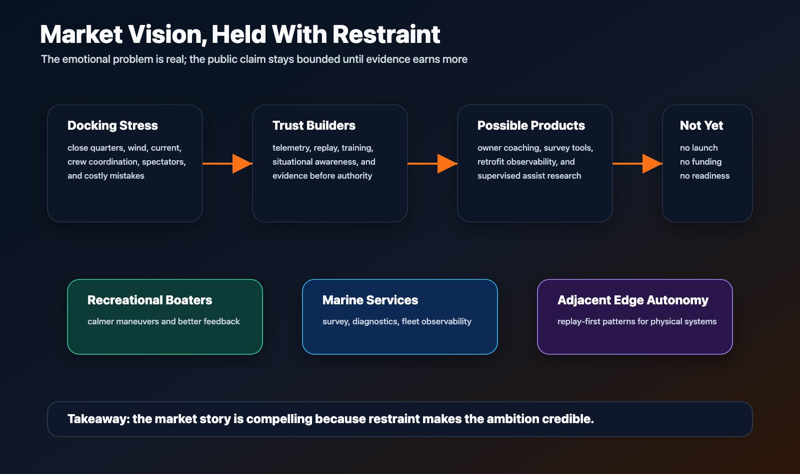

# Problem And Opportunity

BoatAutonomy starts with a plain boating problem: docking can turn a good day
on the water into a tense, expensive, and very public moment. The boat is close
to hard objects. Wind and current matter. Crew coordination is imperfect.
Visibility is limited. The cost of a mistake is real.

The project uses that problem as a serious physical-system target. It is small
enough for one owner-builder to move quickly, but concrete enough that easy
claims fail fast.

Editable source:
[market-business-fit.svg](../assets/diagrams/market-business-fit.svg).

## Why This Is Worth Attention

The visible ambition is easy to remember. The responsible public claim is
narrower: build the telemetry, replay, edge compute, evidence, safety policy,
and AI-assisted engineering harness needed before any real vessel can move
from passive observation toward supervised docking-assist experiments. The
instrumented-survey path turns observed vessel and electronics behavior into
replay and simulation inputs for the developing digital twin the project needs
before assistive behavior is credible.

That makes the project useful to several audiences:

- Boaters recognize the stress and value of calmer close-quarters handling.
- Marine technologists recognize the sensor, network, retrofit, and safety
  constraints.
- Cloud and edge engineers recognize the need for replay, observability,
  resilience, and evidence.
- AI builders recognize the challenge of using agents and models without
  surrendering accountability.
- Potential partners can see a market intuition without mistaking it for a
  finished product claim.

## Why It Is Hard

Marine assistance is not only an autonomy problem. It is a systems problem:

- Noisy sensors and inconsistent source behavior.
- Intermittent connectivity.
- Edge compute and power limits.
- Real-world timing and recovery constraints.
- Human-machine teaming.
- Liability, trust, and physical override boundaries.
- A large gap between an impressive demo and a system that can be operated.

That is why BoatAutonomy emphasizes observation, replay, evidence, staged
promotion, and explicit owner authority.

## Opportunity

The long-term product intuition is that boaters do not need a magic black box.
They need calmer maneuvers, better awareness, better training feedback, and
technology that earns trust before it asks for authority.

The first opportunity is recreational docking and close-quarters assistance.
The broader opportunity may be a repeatable pattern for physical-system
autonomy: telemetry, replay, edge operations, governed AI-assisted delivery,
pre-change validation against observed behavior, developing digital twins from
instrumented surveys, and safety gates that can be explained to technical,
operational, and business stakeholders.

The near-term business value is not a finished autonomy claim. It is the
ability to move more discovery, simulation, and review into reusable evidence,
reducing dependence on expensive field-only debugging cycles.

## Current Boundary

This public repo is not the private implementation, a live-system runbook, or
a claim that autonomous docking is complete.

It is a controlled public surface for the problem, the system shape, the safety
boundary, the evidence discipline, and the builder's relevant experience.
