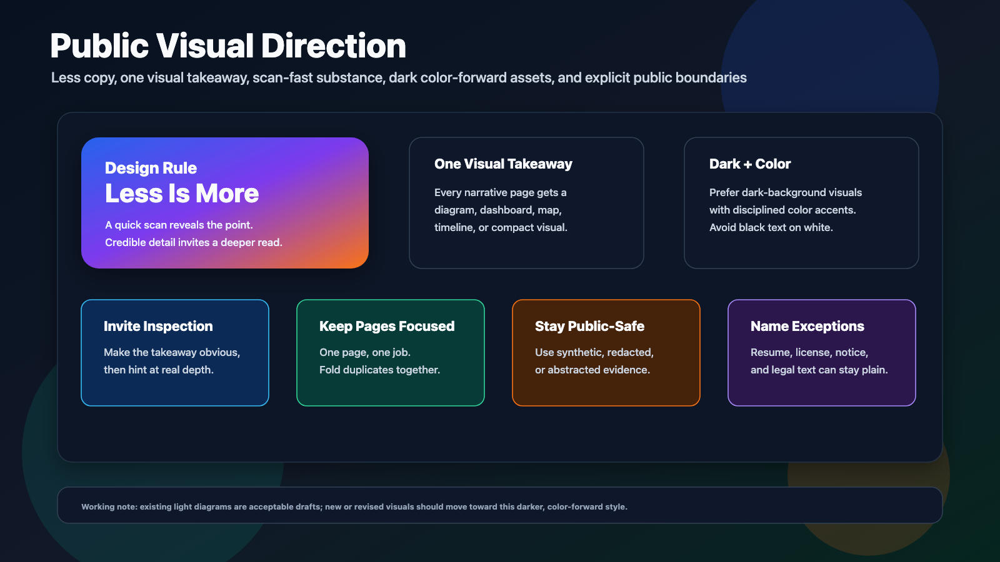

# Publication Guidelines

This repo is designed to be public-facing, not automatically public. Owner
approval is required before publication.

## Visual Direction

Editable source:
[public-visual-guidelines.svg](../assets/diagrams/public-visual-guidelines.svg).

- Less is more. Each page should have one clear job and one visual takeaway.
- Every narrative page should include a graphic near the top: diagram,
  dashboard, map, timeline, system shape, or other compact visual summary.
- Graphics should work at two speeds: easy to scan for the takeaway, with
  enough credible, well-organized detail to invite deeper inspection. Avoid
  visuals that read as decorative or superficial.
- Prefer color-forward visuals on dark backgrounds. Avoid black text on white
  except for formal documents or unavoidable source artifacts.
- Keep diagrams public-safe: no credentials, endpoints, private topology,
  raw telemetry, exact locations, or operational runbooks.
- Rationalize overlapping pages instead of adding a new page for every diagram.
- Acceptable exceptions: `LICENSE.md`, `NOTICE.md`, resume text, and other
  formal/plain-text records where a graphic would be distracting.

Current note: some existing diagrams are light-background drafts. New or revised
visuals should move toward the darker public style.

## Allowed

- Architecture summaries.
- Safety-boundary language.
- Synthetic telemetry.
- Redacted dashboards.
- Public resume or portfolio wording approved by the owner.
- Public-safe future business-direction language approved by the owner, as
  long as it is explicit that no current solicitation is being made.
- Market-facing language approved by the owner, as long as it preserves the
  current research/exploration status and avoids unsupported market-size
  claims.
- Sanitized evidence summaries that preserve caveats and residual risk.
- General references to SeaTalk NG, NMEA 2000, SignalK-style data models,
  Kubernetes, edge compute, and multi-agent workflows.

## Not Allowed

- Credentials, tokens, keys, kubeconfigs, or recovery material.
- Public IPs, private IPs, hostnames, tunnels, or topology details.
- Raw vessel telemetry, packet captures, videos, screenshots with location
  data, or routes.
- Marina, yard, vendor, quote, repair, serial, or equipment-specific packets.
- Live dashboards, operational endpoints, admin paths, or runbooks.
- Unreviewed claims that the boat docks itself unattended.
- Fundraising terms, valuation claims, investment-offer language, customer
  commitments, revenue claims, or safety-certification claims.
- Unsupported global market-size claims or statements that imply product
  readiness, regulatory approval, insurance acceptance, or commercial
  deployment.
- Implementation details that materially reduce the safety or privacy of the
  private system.
- Verbatim resume details that add unnecessary inference risk, including street
  address, personal phone number, clearance specifics, protected customer
  details, or sensitive program identifiers.

## Review Before Publish

Before any commit becomes public, run a plain-text scan for addresses,
credentials, hostnames, serials, personal names, location data, and internal
repository names. Then perform a human review for overclaiming, privacy
leakage, and instructions that would make the private system easier to attack
or misuse.
