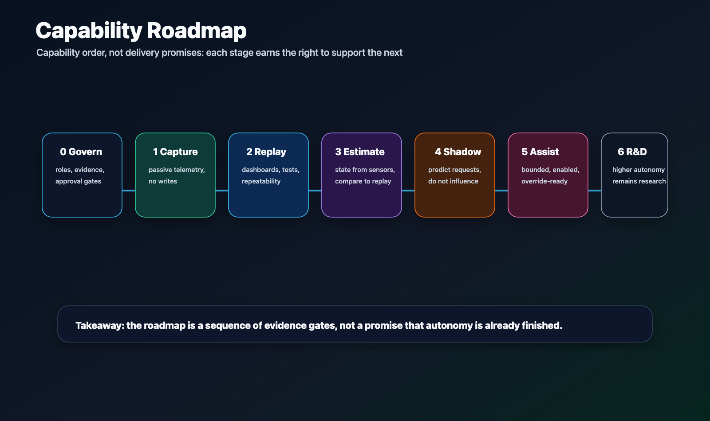

# Roadmap

This roadmap describes capability order, not delivery promises.

Editable source:
[roadmap-stages.svg](../assets/diagrams/roadmap-stages.svg).

## Stage 0 - Governance And Safety

Define what agents may do, what requires owner approval, how evidence is
recorded, and what must remain outside the public repo.

## Stage 1 - Passive Telemetry

Capture and decode marine-network data without writing to the vessel bus or
controlling anything physical.

## Stage 2 - Replay And Observability

Replay captured or synthetic telemetry into repeatable dashboards, queries,
and tests. Use replay to debug before touching the real vessel.

## Stage 3 - State Estimation

Estimate vessel state from sensors and environmental context. Compare
estimates against replayed sessions before considering live use.

## Stage 4 - Shadow Mode

Run assistive logic in observation-only mode. The system may predict what it
would request, but it does not influence control.

## Stage 5 - Supervised Docking Assist

Only after explicit design review and owner approval, test bounded assistive
behavior with operator enable, immediate physical override, deterministic
limits, watchdogs, and safe-state handling.

## Stage 6 - Higher Autonomy Research

Any higher-autonomy work remains research until it has passed safety analysis,
evidence gates, failure injection, and owner approval. The public repo should
not imply this stage exists in production.
