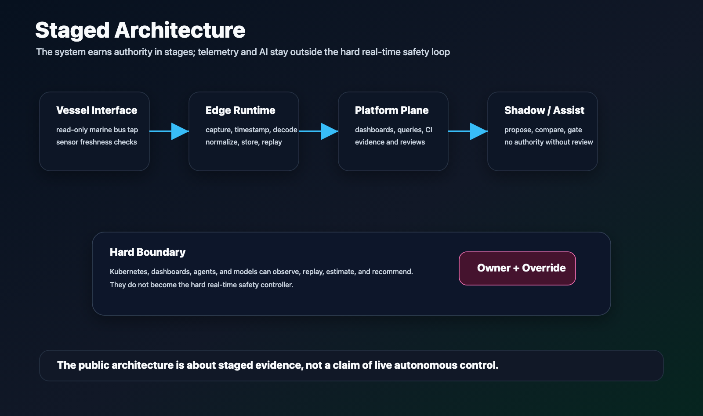

# System Platform

BoatAutonomy is organized as a replay-first, evidence-gated platform around a
real recreational vessel. Marine signals enter as captured observations. Edge
and cluster services normalize, replay, inspect, and test those observations.
AI, dashboards, and agents may help interpret evidence or propose work, but
human authority, physical override, and safe-state behavior remain explicit.

This page is intentionally public-safe. It describes the shape of the system
without publishing private topology, live endpoints, raw telemetry, actuator
details, or operational runbooks.

## Staged Architecture

Editable source:
[architecture-boundary.svg](../assets/diagrams/architecture-boundary.svg).

Each layer earns promotion with recorded evidence before the next layer is
allowed to depend on it.

Design rules:

- Observe before estimating.
- Replay before shadow mode.
- Shadow mode before assist.
- Assist only with operator enable, physical override, bounded outputs, and
  fault handling.
- Keep raw vessel data, packet captures, and large artifacts outside public Git.
- Treat model output as a request to a bounded controller, not as a command.
- Keep Kubernetes, dashboards, and agents outside the hard real-time safety
  path.

## Platform Pattern

Editable source:
[boat-autonomy-platform.svg](../assets/diagrams/boat-autonomy-platform.svg).

The platform combines marine telemetry, replay, edge operations, multi-agent
engineering, governance, and safety boundaries into a pattern that could
matter to other physical-system projects.

Kubernetes and agentic tooling are useful around the system: recording,
monitoring, replay, perception experiments, observability, and deployment
repeatability. They are not the hard real-time safety controller and do not
receive direct actuator authority.

## Development And Field Pipeline

Editable source:
[development-field-pipeline.svg](../assets/diagrams/development-field-pipeline.svg).

The platform is also a delivery system. BCH bench work feeds two linked paths:
a physical validation lane from STG toward QST and real SeaTalk NG / NMEA 2000
sensor evidence, and a TVL DevOps lane for Lima vz, macOS containers,
Kubernetes, Flux, GitOps, SignalK, InfluxDB, Grafana, survey dashboards, remote
debugging, and field-style development.

Terraform, Ansible, and cloud-init matter because rebuildability is part of the
platform, not an afterthought. Future sensor applications may include Go or
Rust collectors and narrowly justified WASM validators, but only where they
show measured benefit.

## Maturity Signals

The public repository does not expose the private implementation, but it can
show the shape of a mature platform:

- It is replay-first. New behavior should be tested against recorded or
  synthetic sessions before it is trusted near live vessel behavior.
- It is evidence-driven. Decisions, assumptions, reviews, and caveats are
  recorded as part of the engineering process.
- It has separation of duties. Implementation, review, research, and owner
  approval are distinct roles.
- It uses infrastructure deliberately. Kubernetes supports recording,
  monitoring, replay, orchestration, and supervisory services, not hard
  real-time safety control.
- It keeps data boundaries visible. Raw telemetry, private dashboards, live
  topology, and operational details stay outside the public repo.
- It treats autonomy as staged capability: capture, replay, observe, estimate,
  shadow, assist.

## Technical Breadcrumbs

The diagrams intentionally expose technical vocabulary without exposing private
topology:

- Infrastructure as code: Terraform, Ansible, and cloud-init.
- Local and edge compute: Lima vz, macOS containers, Kubernetes, Flux, and
  GitOps.
- Telemetry inspection: SignalK, InfluxDB, and Grafana.
- Project control: local and edge GitLab records, hosted backup, and an
  approved GitHub mirror path.
- Model and runtime experiments: Tower as a private local model lane, plus
  possible future Go / Rust collectors and narrowly scoped WASM validators
  where measured benefit justifies the machinery.

## Why Technologists Should Care

Many physical-system projects fail to separate a compelling demo from an
operable platform. BoatAutonomy is being shaped around the harder concerns
early:

- Can the system explain what happened after a session?
- Can a new behavior be replayed before it is trusted?
- Can AI-generated work be reviewed and governed?
- Can edge services tolerate intermittent connectivity?
- Can evidence survive across rebuilds, migrations, and incidents?
- Can model output be kept away from direct physical authority until a safety
  case exists?

That makes the project relevant beyond recreational docking. The same pattern
could apply to field robotics, small-vessel systems, industrial telemetry,
remote infrastructure, training systems, survey workflows, or other domains
where autonomy has to earn trust through evidence.
